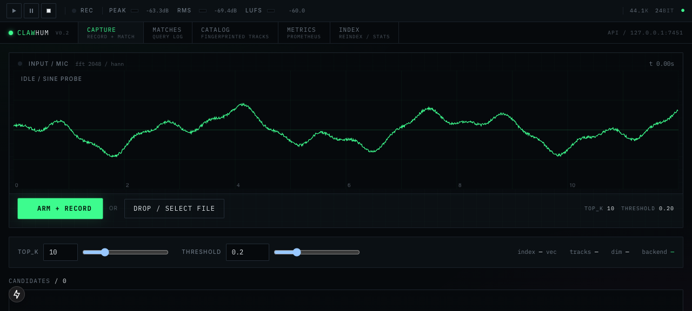

# ClawHum

Query-by-humming. Hum a melody or upload a clip, get ranked matches from a local library or Spotify catalog.

## Per-workspace closure / wind-down lifecycle

GDPR Article 17 (right to erasure), CCPA §1798.105, and almost every enterprise MSA require a clearly defined account-closure pathway with a grace window for data extraction. Workspace admins can now schedule a closure with a bounded grace period (1 minute to 30 days, default 7 days) via `POST /workspace/closure`. While the closure is `scheduled`, the auth middleware rejects every mutating request to that workspace with `HTTP 423 Locked` and a structured `workspace_closing` detail plus `X-Workspace-State` and `X-Workspace-Finalize-At` headers so SDKs can route the customer to a "cancel or export now" runbook. Reads keep working so the customer can pull data out. Once the finalize timestamp elapses, the workspace transitions to `closed` and every non-export route returns `HTTP 410 Gone`; the closure status, audit log, privacy / export, MFA, and `/me` routes stay reachable so the customer can finish wind-down. The closure log is append-only JSONL (same pattern as legal_hold and SSO) so the timeline survives for auditors. Cancellation by another admin (with MFA step-up) immediately restores write access. Cross-tenant isolation: scheduling closure on tenant A has zero effect on tenant B. Pinned by `tests/integration/test_workspace_closure.py`.

### Try it (workspace closure)

UI: open [`/settings/workspace-closure`](http://127.0.0.1:7452/settings/workspace-closure) for the admin panel (status, countdown, schedule with grace presets, type-to-confirm, cancel). API:

```bash
# schedule a closure with a 24h grace window (admin + MFA)
curl -sS -X POST http://127.0.0.1:7451/workspace/closure \
  -H 'X-API-Key: sk_admin' -H 'Content-Type: application/json' \
  -d '{"reason":"contract terminated","grace_seconds":86400}'

# during the grace window, mutations are rejected
curl -sS -i -X POST http://127.0.0.1:7451/collections \
  -H 'X-API-Key: sk_admin' -d '{"title":"too late"}'
# HTTP/1.1 423 Locked
# X-Workspace-State: scheduled
# X-Workspace-Finalize-At: 1780356440.0

# cancel the closure (admin + MFA) to resume writes
curl -sS -X POST http://127.0.0.1:7451/workspace/closure/<id>/cancel \
  -H 'X-API-Key: sk_admin'

# inspect the append-only closure timeline
curl -sS http://127.0.0.1:7451/workspace/closure/history -H 'X-API-Key: sk_admin'
```

## Per-workspace vendor support access grants

Enterprise procurement keeps asking the same question: "when your support staff need to look at our data to debug an incident, how is that access authorised, scoped, time-boxed, and recorded?" Each workspace can now answer it from [`/settings/support-access`](http://127.0.0.1:7452/settings/support-access). A workspace owner grants a named clawhum support actor (identified by email) either `read` or `write` access for a bounded window (hard cap 7 days) with a stated reason that lands in the audit log. Inbound requests that carry `X-Support-Actor: <email>` are checked against the workspace's active grants at the auth layer: with no active grant the request is rejected HTTP 403 before any route runs, and the same support email cannot ride a grant from tenant A into tenant B. With an active grant, every mutating action is recorded in the tamper-evident audit chain with `support_actor` and `support_grant_id` fields stamped automatically by the audit middleware, giving the customer a defensible forensic trail for SOC2 CC6.1 and ISO 27001 A.9.2.3 reviews. Read grants restrict the support actor to safe HTTP methods; revocation takes effect on the next request. Mutations require the admin role plus a fresh MFA step-up. Cross-tenant isolation, RBAC, scope enforcement, revocation, and TTL cap are pinned by `tests/integration/test_support_access.py`.

### Try it (support access grants)

UI: <http://127.0.0.1:7452/settings/support-access> (admin role, MFA).

```bash
# grant alice@clawhum.com read access for an hour
curl -sS -X POST http://127.0.0.1:7451/support-grants \
  -H 'X-API-Key: sk_admin' -H 'Content-Type: application/json' \
  -d '{"support_actor":"alice@clawhum.com","scope":"read","reason":"Debug match latency for ticket #42","ttl_seconds":3600}'

# support staff acting under the grant
curl -sS http://127.0.0.1:7451/me \
  -H 'X-API-Key: sk_admin' -H 'X-Support-Actor: alice@clawhum.com'

# revoke instantly when the incident closes
curl -sS -X POST http://127.0.0.1:7451/support-grants/<id>/revoke \
  -H 'X-API-Key: sk_admin' -H 'Content-Type: application/json' \
  -d '{"reason":"incident closed"}'
```

## Per-workspace PAT scope policy

Enterprise procurement keeps asking the same question: "can an admin in our workspace ever mint a PAT carrying `write:keys` or `admin` scope?". With nothing in place the answer is yes, because the admin role implies every scope. Workspace owners can now pin the maximum scope set their workspace is ever allowed to mint at [`/settings/scope-policy`](http://127.0.0.1:7452/settings/scope-policy). When a policy is active, `POST /keys` clamps requested scopes to (caller role scopes ∩ workspace policy scopes), and any explicit out-of-policy scope is rejected with HTTP 403 and a machine-parseable `scope_not_allowed` error code carrying the denied scope list. Default (unset) PATs minted under an active policy are stored with scopes already clamped so the dashboard's effective-scopes column never lies. `GET /keys/policy` surfaces the workspace pin so the create-key UI never offers a scope the server will reject. Mutations require the admin role plus a fresh MFA step-up and are written to the tamper-evident audit chain with before and after snapshots. Tenant scoped end to end: tenant A cannot read or affect tenant B's pin. Pinned by `tests/integration/test_scope_policy.py`.

### Try it (scope policy)

```bash
curl -sS -X PUT http://127.0.0.1:7451/scope-policy \
  -H 'X-API-Key: sk_admin' \
  -H 'Content-Type: application/json' \
  -d '{"scopes":["read:matches","read:library"]}'

curl -sS http://127.0.0.1:7451/scope-policy -H 'X-API-Key: sk_admin'
```

## Per-workspace security and breach notification contacts

EU customers and enterprise procurement teams will not sign a paid contract without a documented contact path for security incidents (GDPR Art. 33 requires processors to notify controllers "without undue delay" on becoming aware of a personal data breach; SOC2 CC7.4 requires defined incident communication channels). Each workspace can now register the people we will reach during an incident at [`/settings/security-contacts`](http://127.0.0.1:7452/settings/security-contacts). Each contact carries an email, optional name and phone, and a role from `security`, `privacy`, `legal`, or `ops`. Exactly one contact per workspace may be marked primary; promoting a new primary demotes the previous one in a single audit-logged step. The roster is tenant scoped end to end: an admin in tenant A cannot list, create, delete, or promote contacts belonging to tenant B even when guessing the contact id (HTTP 404). Mutations require the admin role plus a fresh MFA step-up, and flow through the existing tamper-evident audit chain so reviewers get a forensic record of every change to the incident contact list. Email validation, role allowlisting, and duplicate-email rejection return structured 400s the admin console renders inline. Cross-tenant isolation, RBAC, and validation are pinned by `tests/integration/test_security_contacts.py`.

### Try it (security contacts)

```bash
curl -sS -X POST http://127.0.0.1:7451/security-contacts \
  -H 'X-API-Key: sk_admin' \
  -H 'Content-Type: application/json' \
  -d '{"email":"soc@acme.com","name":"SOC Team","role":"security","primary":true}'

curl -sS http://127.0.0.1:7451/security-contacts -H 'X-API-Key: sk_admin'
```

## Per-workspace Data Processing Agreement acceptance

No enterprise buyer signs a paid contract before a named, authorised person from their workspace has clicked accept on the vendor's Data Processing Agreement (GDPR Art. 28, CCPA service-provider obligations, SCC regimes). The workspace admin console at [`/admin/dpa`](http://127.0.0.1:7452/admin/dpa) now exposes the current vendor DPA version and URL, shows whether the workspace has accepted it, and records who clicked accept, when, from which IP, and with which user agent. Acceptance requires the admin role plus a fresh MFA step-up, and the mutation flows through the existing tamper-evident audit chain so reviewers get a forensically defensible record without extra plumbing. The client must echo the published version string when accepting, so a stale client cannot bind the workspace to an outdated contract (HTTP 422 `dpa_version_mismatch`). Cross-tenant isolation, role enforcement, version pinning, and withdraw/re-accept are pinned by `tests/integration/test_dpa.py`.

### Try it (DPA acceptance)

UI: <http://127.0.0.1:7452/admin/dpa> (admin role, MFA).

```bash
# read the current vendor version + your workspace's acceptance state
curl -s $CLAWHUM_API_URL/v1/dpa -H "X-API-Key: $CLAWHUM_ADMIN_KEY"

# accept (echo the version the server publishes)
curl -s -X POST $CLAWHUM_API_URL/v1/dpa/accept \
  -H "X-API-Key: $CLAWHUM_ADMIN_KEY" -H 'content-type: application/json' \
  -d '{"version":"2025-05-01"}'

# withdraw
curl -s -X DELETE $CLAWHUM_API_URL/v1/dpa -H "X-API-Key: $CLAWHUM_ADMIN_KEY"
```

## Per-workspace invite domain allowlist

Enterprise procurement routinely requires that a workspace only ever grant seats to corporate identities, so a compromised admin cannot quietly invite a personal Gmail as a backdoor. Each workspace now carries an optional list of allowed email domains. When at least one rule is registered, every seat-granting path (manual `POST /members/invite`, `POST /members/accept`, SSO auto-join, SCIM-side provisioning) routes through the same allowlist and rejects out-of-policy emails with HTTP 422 `invite_domain_not_allowed`. An empty list means no restriction so existing tenants keep working unchanged. Subdomain matching is opt-in per rule (`include_subdomains=true`) and only relaxes the rule downward, so pinning `acme.com` lets `alice@us.acme.com` through but never `evil-acme.com`. Admins manage the list from [`/settings/invite-domains`](http://127.0.0.1:7452/settings/invite-domains) (admin role plus step-up MFA). Cross-tenant isolation, subdomain semantics, and the accept-time re-check are pinned by `tests/integration/test_invite_domains.py`.

### Try it (invite domain allowlist)

```sh
export CLAWHUM_API_URL=http://127.0.0.1:7451

# Pin the workspace to @acme.com (admin role + fresh TOTP required).
curl -s -X POST $CLAWHUM_API_URL/v1/invite-domains \
  -H 'X-API-Key: opskey' -H 'X-MFA-Code: 123456' \
  -H 'content-type: application/json' \
  -d '{"domain": "acme.com", "include_subdomains": true, "label": "corp"}'

# Out-of-policy invites are rejected with HTTP 422.
curl -s -X POST $CLAWHUM_API_URL/v1/members/invite \
  -H 'X-API-Key: opskey' -H 'content-type: application/json' \
  -d '{"email": "someone@gmail.com", "role": "member"}'
```

## MFA step-up session (sudo mode)

Once MFA is enrolled, every destructive admin call requires a fresh `X-MFA-Code`. That gate is correct but the UX of retyping a TOTP for every click pushes admins to disable MFA in practice. Sudo mode lets an admin exchange one TOTP for a short-lived `X-MFA-Session` token (default 5 minutes, server-capped to `mfa_session_max_ttl_seconds`, hard ceiling 1h) that stands in for the code on subsequent calls. The token is HMAC-SHA256 signed by a machine-local secret in the data directory, cryptographically bound to `(tenant_id, actor_id)` so a leaked token cannot replay against any other actor, and tied to a per-actor revocation epoch that is bumped on MFA disable, force-logout-all, or an explicit revoke. Issuance and revoke flow through the tamper-evident audit log. Cross-actor rejection, expiry, epoch revocation, and the `ttl=0` kill-switch are pinned by `tests/integration/test_mfa_session.py`. The workspace UI lives at `http://127.0.0.1:7452/settings/security/sudo`.

### Try it (sudo mode)

```sh
export CLAWHUM_API_URL=http://127.0.0.1:7451
export CLAWHUM_ADMIN_KEY=opskey

# 1. Exchange a TOTP for a step-up session token.
curl -s -X POST -H "X-API-Key: $CLAWHUM_ADMIN_KEY" \
  -H "Content-Type: application/json" \
  -d '{"code":"123456"}' \
  $CLAWHUM_API_URL/mfa/session
# -> {"token":"v1.eyJ...","ttl_seconds":300,"expires_at":...}

# 2. Reuse it on any destructive admin call.
curl -s -X DELETE -H "X-API-Key: $CLAWHUM_ADMIN_KEY" \
  -H "X-MFA-Session: v1.eyJ..." \
  $CLAWHUM_API_URL/keys/pat_abc

# 3. Lock sudo mode (revokes every outstanding token for this actor).
curl -s -X DELETE -H "X-API-Key: $CLAWHUM_ADMIN_KEY" \
  $CLAWHUM_API_URL/mfa/session
```

## Audit log forwarding to your SIEM

Stream every audit event to a customer-controlled HTTPS sink (Splunk HEC,
Datadog, Sumo, Panther, generic collector) in near real time. Each delivery
is signed with HMAC-SHA256 in the `X-ClawHum-Signature` header so the
receiver can verify authenticity. Failed deliveries retry with capped
exponential backoff and stay in a per-workspace delivery log for replay.
Destinations are tenant-scoped: a workspace can never see or send to
another workspace's sink.

### Try it

UI: <http://localhost:7452/admin/audit-forwarding> (admin role, MFA).

```bash
# Register a destination (returns the signing secret exactly once).
curl -sS -X PUT http://localhost:7451/audit-forwarding \
  -H "X-API-Key: $CLAWHUM_API_KEY" \
  -H "Content-Type: application/json" \
  -d '{"url":"https://siem.example.com/ingest"}'

# Fire a test event and view delivery log.
curl -sS -X POST http://localhost:7451/audit-forwarding/test \
  -H "X-API-Key: $CLAWHUM_API_KEY" -H "Content-Type: application/json" \
  -d '{"secret":"awsec_..."}'
curl -sS http://localhost:7451/audit-forwarding/deliveries \
  -H "X-API-Key: $CLAWHUM_API_KEY"
```

## Force PAT rotation (max-age policy)

Workspace admins can set `max_pat_age_minutes` in the session policy to require every personal access token to be rotated at least every N minutes. Any PAT whose `created_at` exceeds that age is rejected at auth with `HTTP 401 pat_aged_out`, even when its own `expires_at` would still permit it. Rotating the token (`POST /keys/{id}/rotate`) refreshes `created_at` so the new secret satisfies the policy. The `/settings/keys` console badges aging tokens (`rotate soon`, `aged out`) and the rule lives in `tests/integration/test_sessions.py::test_max_pat_age_policy_rejects_aged_tokens`. Same control SOC2 / ISO 27001 auditors expect for credential rotation.

### Try it (force PAT rotation)

```bash
# Require every PAT to be rotated at least once per 90 days.
curl -X PUT http://127.0.0.1:8000/sessions/policy \
  -H "X-API-Key: sk_admin" -H "Content-Type: application/json" \
  -d '{"idle_timeout_minutes":0,"absolute_max_minutes":0,"max_pat_lifetime_minutes":0,"max_pat_age_minutes":129600}'

# Aged PATs return 401 with detail starting with "pat_aged_out".
curl -i http://127.0.0.1:8000/me -H "X-API-Key: pat_<aged_secret>"
```

## Revoke idle PATs (max-idle policy)

SOC2 CC6.1 and ISO 27001 A.9.2.6 both require that unused credentials are deactivated within a defined window. Workspace admins can set `max_pat_idle_minutes` in the session policy to auto-revoke any personal access token whose `last_used_at` (or `created_at`, if it has never been used) is older than N minutes. Idle tokens are rejected at auth with `HTTP 401 pat_idle_revoked` and the `/settings/keys` console badges them (`idle soon`, `idle revoked`). The owner can mint a replacement to satisfy the policy; the existing token is not silently resurrected by a probe. Coverage: `tests/integration/test_sessions.py::test_max_pat_idle_policy_revokes_unused_tokens`.

### Try it (revoke idle PATs)

```bash
# Revoke any PAT that has gone unused for 30 days.
curl -X PUT http://127.0.0.1:8000/sessions/policy \
  -H "X-API-Key: sk_admin" -H "Content-Type: application/json" \
  -d '{"idle_timeout_minutes":0,"absolute_max_minutes":0,"max_pat_lifetime_minutes":0,"max_pat_age_minutes":0,"max_pat_idle_minutes":43200}'

# Stale PATs return 401 with detail starting with "pat_idle_revoked".
curl -i http://127.0.0.1:8000/me -H "X-API-Key: pat_<stale_secret>"
```

Local UI: <http://127.0.0.1:3000/settings/sessions>.



## Webhook egress IP disclosure

Enterprise procurement teams will not turn on outbound webhooks until their network group has pinned the source addresses in a corporate firewall. A new `GET /v1/webhooks/egress-ips` endpoint and a [`/settings/webhook-egress`](http://127.0.0.1:7452/settings/webhook-egress) page disclose exactly which IPv4/IPv6 addresses or CIDRs this deployment dispatches webhook deliveries from, along with an `updated_at` timestamp so SecOps can detect drift between their allowlist and what the deployment now claims to send. Operators pin the list by setting `CLAWHUM_WEBHOOK_EGRESS_IPS` (comma separated; typos are dropped rather than 500ing the endpoint) and `CLAWHUM_WEBHOOK_EGRESS_UPDATED_AT`. When the list is empty the response explicitly reports `pinned=false` with a note that the egress is dynamic, so the contract is unambiguous. Auth is required so anonymous scanners cannot harvest the list, but no role gate, because every member of every workspace needs to be able to share it with their own network team. Contract pinned by `tests/integration/test_webhook_egress_ips.py`.

### Try it (egress IPs)

```bash
# View the disclosed source addresses for outbound webhook deliveries.
curl -s -H "X-API-Key: $CLAWHUM_API_KEY" \
  http://127.0.0.1:7451/v1/webhooks/egress-ips | jq
# {
#   "pinned": true,
#   "addresses": ["203.0.113.10", "198.51.100.0/24"],
#   "updated_at": "2026-05-30T18:00:00Z",
#   "note": "Add these source addresses to your firewall allowlist..."
# }
```

## Data retention policy UI

Enterprise contracts pin a maximum lifetime on every category of stored data, but a CLI-only retention API forces ops teams to script what should be a one-click setting. Each workspace now has a [`/settings/retention`](http://127.0.0.1:7452/settings/retention) console that reads the live policy, edits per-category TTLs for match history, feedback, audit log, and webhook deliveries, previews a sweep with `dry_run=true` (no rows touched, counts only), and runs a real enforce with admin role plus a fresh TOTP code. Reads filter expired rows immediately so the policy takes effect before disk is rewritten. The dry-run preview returns the same `{removed: {history, feedback, audit, webhook_deliveries}}` shape as a real enforce so the UI can render the impact before the destructive button is pressed, and a confirm dialog gates the irreversible call. Cross-tenant isolation, admin-only access, and the dry-run preview shape are pinned by `tests/integration/test_retention.py`.

### Try it (retention)

```bash
# View the active policy for your workspace.
curl -s -H "X-API-Key: $CLAWHUM_ADMIN_KEY" \
  http://127.0.0.1:7451/retention | jq

# Preview a sweep without touching disk.
curl -s -X POST -H "X-API-Key: $CLAWHUM_ADMIN_KEY" \
  'http://127.0.0.1:7451/retention/enforce?dry_run=true' | jq

# Set a 90 day history TTL (admin + MFA).
curl -s -X PUT -H "X-API-Key: $CLAWHUM_ADMIN_KEY" -H "X-MFA-Code: 123456" \
  -H 'Content-Type: application/json' \
  -d '{"history_days":90,"feedback_days":365,"audit_days":2555,"webhook_deliveries_days":30}' \
  http://127.0.0.1:7451/retention | jq
```

## Per-token source IP history

Every successful authentication with a personal access token records the resolved source IP, with first and last seen timestamps, an incrementing count, and the most recent user agent. Workspace admins can list the distinct IP timeline for any token they own to triage a suspected credential leak. Cross workspace lookups return 404, never 403, so token ids cannot be enumerated across tenants.

### Try it (per-token IP history)

```
curl -s -X POST http://127.0.0.1:7452/keys \
  -H 'X-API-Key: $ADMIN_KEY' -H 'Content-Type: application/json' \
  -d '{"name":"ci"}'

curl -s http://127.0.0.1:7452/me -H 'X-API-Key: $PAT_SECRET' -H 'X-Forwarded-For: 203.0.113.10'
curl -s http://127.0.0.1:7452/me -H 'X-API-Key: $PAT_SECRET' -H 'X-Forwarded-For: 198.51.100.7'

curl -s http://127.0.0.1:7452/keys/$PAT_ID/ip-history -H 'X-API-Key: $ADMIN_KEY' | jq
```

Open <http://127.0.0.1:3000/settings/keys> and click `ip history` on any row.

## Share link expiry and 410 governance

Enterprise security reviews flag any product that mints permanent public URLs: a leaked link is a leaked record forever. Public `/r/<id>` share pages now carry an optional `expires_at` and the server enforces it. Callers can pass `expires_in_days` on `POST /share` (0 means no expiry, omitted falls back to the workspace default), and the same field on `PATCH /share/{id}` extends or clears the lifetime without rotating the id. Once the clock passes, the public `GET /share/{id}` returns HTTP 410 Gone with a structured `share link expired` body instead of 200, so crawlers, oEmbed consumers, and Slack unfurls stop pointing at the resource. The owner's `/share` listing still returns the row with `expired: true` so the workspace can either revoke it or extend it; cross-tenant patches and revokes still 404 by design. Two new server-side knobs make this a procurement lever: `CLAWHUM_SHARE_DEFAULT_TTL_DAYS` applies an automatic lifetime to every new share (set it to 30 once and every client respects it), and `CLAWHUM_SHARE_MAX_TTL_DAYS` clamps any caller request, including legacy clients that ask for non-expiring links when a deployment-wide ceiling is in force. The shares table at [`/shares`](http://127.0.0.1:7452/shares) renders a duotone `expires in 7d` badge (warning tint inside 72 hours, magenta when expired) and the public page swaps in a calm 410 surface instead of a generic 404. Audit middleware already captures share create, patch, and revoke so the expiry policy plugs straight into the tamper-evident hash chain. Workspace default application, server-side max clamp, 410 on expired reads, owner-driven extension, expiry isolation across tenants, and the no-default-expiry baseline are pinned by `tests/integration/test_share.py`.

### Try it (share link expiry)

```bash
# Create a share that self-revokes in 7 days.
curl -s -X POST http://127.0.0.1:7451/share \
  -H "X-API-Key: $CLAWHUM_API_KEY" \
  -H 'Content-Type: application/json' \
  -d '{"query_id":"q1","elapsed_ms":42,"count":1,"expires_in_days":7,
       "results":[{"track_id":"t1","title":"demo","artist":"x",
                   "score":0.9,"segment_index":0}]}' | jq

# Extend a link from /shares without rotating its id.
curl -s -X PATCH http://127.0.0.1:7451/share/<id> \
  -H "X-API-Key: $CLAWHUM_API_KEY" \
  -H 'Content-Type: application/json' \
  -d '{"expires_in_days":30}' | jq

# Public read after expiry returns 410 Gone, not 404.
curl -s -i http://127.0.0.1:7451/share/<expired-id> | head -1
```

## Per-workspace embed origin allowlist

Enterprise buyers reject vendors that let any site frame their workspace content because that turns every public share into a clickjacking primitive against their own users. Each workspace can now register one or more origins (scheme plus host, optional port) that are permitted to embed its public shares. An empty list means "no restriction" so existing embeds keep working unchanged. Admins manage the list from [`/settings/embed-origins`](http://127.0.0.1:7452/settings/embed-origins) (admin role plus a fresh TOTP code). When the list is non-empty three enforcement points fire off the same store: `GET /share/{id}` rejects browser reads from a non-allowed `Origin` with 403, `GET /api/oembed` rejects oEmbed calls from a non-allowed `Origin` with 403 and narrows `Access-Control-Allow-Origin` to the caller rather than `*`, and `/r/{id}/embed` returns a `Content-Security-Policy: frame-ancestors` header narrowed to the allowed origins so a hostile site cannot iframe the embed even if it crafts the URL by hand. Server-to-server reads (no `Origin` header) still resolve so crawlers and link previews keep working. Cross-tenant isolation is pinned by `tests/integration/test_embed_origins.py`.

### Try it (embed origin allowlist)

```bash
# 1. register an allowed origin (admin + MFA)
curl -sS -X POST http://127.0.0.1:7451/embed-origins \
  -H "X-API-Key: $CLAWHUM_ADMIN_KEY" -H 'Content-Type: application/json' \
  -d '{"origin":"https://docs.acme.com","label":"docs portal"}'

# 2. read the public share with a browser-style Origin header
curl -i "http://127.0.0.1:7451/share/$SHARE_ID" -H 'Origin: https://evil.example'
# -> 403 origin not permitted to read this share

curl -s "http://127.0.0.1:7451/share/$SHARE_ID" -H 'Origin: https://docs.acme.com' | jq .embed_allowed_origins
# -> ["https://docs.acme.com"]
```

## Workspace seat license

Enterprise contracts price by seats, so the platform has to refuse seat N+1 instead of silently overflowing the contracted count. Each workspace now has an optional seat cap covering active plus pending members. Admins set it from [`/settings/seat-limit`](http://127.0.0.1:7452/settings/seat-limit) (admin role plus a fresh TOTP code). A cap of 0 means unlimited and is the default, so workspaces without a contract attached keep working unchanged. Once the cap is reached, `POST /members/invite` and SSO domain auto-join both return HTTP 402 Payment Required with a structured body `{error: seat_limit_exceeded, current, limit}` so the UI can render an upgrade affordance instead of a generic failure. Revoked members release their seat; re-activating an existing tombstoned row does not consume a fresh seat. The cap is strictly per workspace and isolation is pinned by `tests/integration/test_seat_limit.py`.

### Try it (seat license)

```bash
# View the current cap and usage.
curl -s -H "X-API-Key: $CLAWHUM_API_KEY" \
  http://127.0.0.1:7451/workspace/seat-limit | jq

# Set a 50-seat cap (admin + MFA).
curl -s -X PUT -H "X-API-Key: $CLAWHUM_API_KEY" -H "X-MFA-Code: 123456" \
  -H 'Content-Type: application/json' -d '{"limit": 50}' \
  http://127.0.0.1:7451/workspace/seat-limit | jq
```

## Idempotency-Key replay cache

Enterprise integrators routinely retry POST/PUT/PATCH/DELETE calls after a network blip. Without server-side de-duplication a retry can double-write feedback, double-fire a webhook, or replay the same admin mutation twice. ClawHum now honors an `Idempotency-Key` header on every mutating route, Stripe-style: the first call's response is cached for 24 hours (configurable via `CLAWHUM_IDEMPOTENCY_TTL_SECONDS`) and replays return the original status, body, and headers tagged with `Idempotent-Replayed: true`. The original request id is surfaced as `X-Original-Request-ID` so log searches can stitch the retry to its origin. Reusing the same key with a different body returns HTTP 409 (`idempotency_key_conflict`) so a buggy client cannot silently overwrite a prior outcome. Keys are scoped per resolved tenant (falling back to the API key hash, then client IP) so two workspaces can reuse the same key string without collision and without information leakage. The cache is bounded per tenant by `CLAWHUM_IDEMPOTENCY_MAX_PER_TENANT` (default 1024, LRU evicted) so one noisy workspace cannot exhaust shared memory. Concurrent retries on the same key serialize on an asyncio lock so the origin runs exactly once. The middleware sits outside the rate limiter so cached replays do not double-charge the workspace quota, and inside the request-id middleware so structured logs still correlate. Replay, conflict, cross-tenant isolation, malformed-key rejection, and passthrough behaviour are pinned by `tests/integration/test_idempotency.py`.

### Try it (idempotency)

```bash
# Start the API with at least one workspace key.
CLAWHUM_API_KEYS=acme:sk_acme:9999:admin:acme uv run uvicorn clawhum_api.app:create_app --factory --port 7451 &

# First call writes feedback and returns Idempotent-Replayed: false.
curl -s -i -X POST http://127.0.0.1:7451/feedback \
  -H 'X-API-Key: sk_acme' \
  -H 'Idempotency-Key: feedback-2026-05-31-001' \
  -H 'Content-Type: application/json' \
  -d '{"query_id":"q1","track_id":"t1","score":0.91,"vote":1}' | head -20

# Replaying the same request returns the cached body and Idempotent-Replayed: true.
curl -s -i -X POST http://127.0.0.1:7451/feedback \
  -H 'X-API-Key: sk_acme' \
  -H 'Idempotency-Key: feedback-2026-05-31-001' \
  -H 'Content-Type: application/json' \
  -d '{"query_id":"q1","track_id":"t1","score":0.91,"vote":1}' | head -20

# Reusing the same key with a different body is rejected with 409.
curl -s -i -X POST http://127.0.0.1:7451/feedback \
  -H 'X-API-Key: sk_acme' \
  -H 'Idempotency-Key: feedback-2026-05-31-001' \
  -H 'Content-Type: application/json' \
  -d '{"query_id":"q1","track_id":"t1","score":0.91,"vote":-1}' | head -20
```

## Per-token last-used forensics

When a personal access token leaks, the first incident-response question is "where was it last used from?" Each PAT now records the resolved client IP (X-Forwarded-For aware) and a length-bounded User-Agent on every successful authentication, surfaced in the same `/keys` response that already powers the settings table. The web UI at [`/settings/keys`](http://127.0.0.1:7452/settings/keys) renders `used: 3m ago from 203.0.113.42` inline with a hover tooltip carrying the full User-Agent so an operator can spot a token being driven from an unexpected host or library without grepping the audit log. Breadcrumbs are tenant-scoped: a sibling workspace listing its own keys can never see another tenant's IPs. The User-Agent is stripped of control bytes and capped at 200 characters so a hostile client cannot bloat the append-only PAT log. Cross-tenant isolation and the IP/UA capture are pinned by `tests/integration/test_pat_last_used_forensics.py`.

### Try it (last-used forensics)

```bash
# Mint a PAT, use it from a known IP, then read the breadcrumb back.
curl -s http://127.0.0.1:7451/v1/keys \
  -H "X-API-Key: $CLAWHUM_ADMIN_KEY" \
  -H 'content-type: application/json' \
  -d '{"name":"ci"}' | jq -r .secret
# export PAT=pat_...
curl -s http://127.0.0.1:7451/me \
  -H "X-API-Key: $PAT" \
  -H 'X-Forwarded-For: 203.0.113.42' \
  -H 'User-Agent: my-ci/1.0' >/dev/null
curl -s http://127.0.0.1:7451/keys \
  -H "X-API-Key: $CLAWHUM_ADMIN_KEY" \
  | jq '.[] | {name, last_used_ip, last_used_ua, last_used_at}'
```

## Per-token IP allowlist

Enterprise security teams want every machine credential pinned to the IP range it should be used from, not just the workspace as a whole. Each personal access token now carries its own list of allowed CIDR ranges; a request authenticated by the token is rejected with HTTP `403 ip ... not in pat allowlist` when the client IP falls outside the list. An empty list means "no restriction" so existing tokens keep working unchanged. The fence applies to IPv4 and IPv6, accepts host addresses (normalised to `/32` and `/128`), collapses duplicates, and caps at 64 ranges per token. Workspace owners edit the list inline at [`/settings/keys`](http://127.0.0.1:7452/settings/keys) (one CIDR per line), or via the REST API at `PUT /v1/keys/{id}/ip-allowlist`. Setting or clearing the list is a destructive admin action: it requires step-up MFA when the workspace enforces it, flows through the tamper-evident audit log via the audit middleware, and honours the existing dry-run mode. The PAT IP fence is independent of the workspace-wide `ip_allowlist`: both gates run, both must pass. Cross-IP isolation, normalisation, validation, and clear-restore behaviour are pinned by `tests/integration/test_pat_ip_allowlist.py`.

### Try it (per-token IP allowlist)

```bash
# Mint a CI token pinned to a build farm range.
curl -s http://127.0.0.1:7451/v1/keys \
  -H "X-API-Key: $CLAWHUM_ADMIN_KEY" \
  -H "Content-Type: application/json" \
  -d '{"name":"github-actions","ip_cidrs":["140.82.112.0/20"]}'

# Tighten or replace the list on an existing token.
curl -s -X PUT http://127.0.0.1:7451/v1/keys/$KEY_ID/ip-allowlist \
  -H "X-API-Key: $CLAWHUM_ADMIN_KEY" \
  -H "Content-Type: application/json" \
  -d '{"cidrs":["10.0.0.0/24","2001:db8::/32"]}'

# Clear the restriction (empty list = usable from any IP).
curl -s -X PUT http://127.0.0.1:7451/v1/keys/$KEY_ID/ip-allowlist \
  -H "X-API-Key: $CLAWHUM_ADMIN_KEY" \
  -H "Content-Type: application/json" \
  -d '{"cidrs":[]}'
```

UI: <http://127.0.0.1:7452/settings/keys>

## Active sessions and force logout

Every authenticated request creates an active session keyed by the tuple `(workspace, actor, IP, user-agent)`. Admins can list them at [`/settings/sessions`](http://127.0.0.1:7452/settings/sessions), revoke a single session, force log out every session for an actor (incident response for a suspected leaked key), or pin a workspace `idle_timeout_minutes`, `absolute_max_minutes`, and `max_pat_lifetime_minutes`. The auth layer enforces those caps on every request and clamps newly minted PAT lifetimes to the workspace cap so a careless operator cannot mint a token that outlives the contract window. Sessions are tenant-scoped at the query layer; the cross-tenant isolation and force-logout behaviour are covered by `tests/integration/test_sessions.py`. Mutating routes require the `admin` role plus a fresh `X-MFA-Code` once MFA is enrolled, and every policy change flows through the audit log.

### Try it (sessions)

```bash
# Start the API with at least one workspace key.
CLAWHUM_API_KEYS='ws_alpha:alpha-admin:9999:admin:alpha' uv run clawhum-api

# In another shell, hit any authenticated route so a session is created.
curl -s -H "X-API-Key: alpha-admin" http://127.0.0.1:7451/me >/dev/null

# List active sessions for the workspace.
curl -s -H "X-API-Key: alpha-admin" http://127.0.0.1:7451/sessions | jq '.items'

# Pin a 60-minute PAT lifetime cap for the whole workspace.
curl -s -X PUT -H "X-API-Key: alpha-admin" -H 'Content-Type: application/json' \
  -d '{"idle_timeout_minutes":0,"absolute_max_minutes":0,"max_pat_lifetime_minutes":60}' \
  http://127.0.0.1:7451/sessions/policy | jq

# Force log out every session for the suspected actor.
curl -s -X POST -H "X-API-Key: alpha-admin" -H 'Content-Type: application/json' \
  -d '{"actor":"alpha","reason":"suspected leak"}' \
  http://127.0.0.1:7451/sessions/revoke-all | jq
```

## What it does

Accepts an audio upload (hum, whistle, recorded clip), decodes it via `soundfile`/`librosa`, and runs it through a DSP pre-processing chain (butterworth biquad band-pass, pre-emphasis at 0.97, optional VAD trim). The cleaned signal is segmented into 6 s windows and embedded with CLAP (`laion/clap-htsat-unfused`) when ML extras are installed, or with a deterministic MFCC + chroma + spectral-contrast hash embedder as fallback. Embeddings are searched against a FAISS HNSW index (or a NumPy brute-force index on Apple Silicon where `faiss-cpu` is unavailable) and reranked by tempo proximity. Results stream back as scored track candidates with previews and artwork. A Prometheus `/metrics` endpoint and structured logs expose request volume, match counts, and index size.

ClawHum is a query-by-humming engine that turns a microphone clip into ranked song matches against a local or Spotify-backed catalog.

## Admin console

Workspace owners get a single overview screen at [`/admin`](http://127.0.0.1:7452/admin) that pulls identity, members, API keys, recent audit events, usage against the configured plan, SSO status, MFA status, IP allowlist and webhook posture into one place. Every card is a live read from an existing tenant scoped backend route (`/me`, `/members`, `/keys`, `/audit`, `/usage`, `/mfa/status`, `/quotas`) with the stored API key forwarded as `X-API-Key`, so the dashboard cannot see another tenant's data even if its key leaks into the browser session. Loading, error and empty states are wired on every card, the page renders cleanly at 375px and 1440px, and a dev-mode banner appears whenever the API is running with `CLAWHUM_API_KEYS` unset so reviewers do not mistake an open development server for production.

### Try it (admin console)

```bash
# Start the API with at least one workspace key set.
CLAWHUM_API_KEYS='ws_alpha:alpha-admin:owner,admin' uv run --extra api clawhum-api
# In another shell, start the web app.
cd web && pnpm dev
# Open the console; paste alpha-admin into Settings, then visit /admin.
open http://127.0.0.1:7452/admin

# Same data, headlessly, from a script:
curl -s -H "x-api-key: alpha-admin" http://127.0.0.1:7451/me | jq
curl -s -H "x-api-key: alpha-admin" 'http://127.0.0.1:7451/audit?limit=6' | jq '.items'
```

## Workspace data residency

EU and APAC enterprise contracts require a hard guarantee that customer data never leaves a named region. Each workspace can pin itself to `us`, `eu`, `apac`, or `unset`. `GET /residency` returns the active pin plus the region this node is deployed in (`CLAWHUM_REGION`) and the master enforcement switch (`CLAWHUM_RESIDENCY_ENFORCEMENT`). `PUT /residency` upserts the pin. Reads require the `admin` role; writes also require a fresh `X-MFA-Code` once the actor has enrolled TOTP. Every pin change flows through the audit log with a before/after diff. The `ResidencyMiddleware` rejects mutating methods (POST/PUT/PATCH/DELETE) with HTTP 451 when the workspace region does not match the node region, naming both regions in the body so the client can route to the correct endpoint. Read traffic (GET/HEAD/OPTIONS) is always allowed cross region so dashboards and audit log viewers keep working from anywhere. Every response carries `X-Data-Region` (the node's region) and, when the workspace has a pin, `X-Workspace-Region`. Cross-tenant isolation is covered by `tests/integration/test_residency.py`, which proves a pinned EU workspace cannot mutate against a US node, that a sibling tenant with no pin is unaffected, and that the global enforcement switch fails open. The workspace UI lives at `http://127.0.0.1:7452/settings/residency`.

### Try it (data residency)

```bash
# Start a US node with at least one admin key.
CLAWHUM_REGION=us \
CLAWHUM_API_KEYS='europa:eu-admin:0:admin|writer:europa' \
  uv run --extra api clawhum-api

# Pin the workspace to EU and turn enforcement on (admin + MFA).
curl -s -X PUT http://127.0.0.1:7451/residency \
  -H 'x-api-key: eu-admin' \
  -H 'x-mfa-code: 000000' \
  -H 'content-type: application/json' \
  -d '{"region":"eu","enforce":true}' | jq

# Reads still work cross region.
curl -i http://127.0.0.1:7451/me -H 'x-api-key: eu-admin' | head -20

# Mutating calls are rejected with 451 from a US node.
curl -i -X POST http://127.0.0.1:7451/feedback \
  -H 'x-api-key: eu-admin' -H 'content-type: application/json' \
  -d '{"track_id":"t1","rating":5}' | head -20
```

## Workspace quota plan

Per-key rate limits cap individual credentials. Enterprise contracts also need a ceiling on aggregate traffic: a workspace can mint many keys and silently outgrow its plan unless the server enforces a tenant wide cap. `GET /quotas` returns the active plan plus a catalog of presets (`free`, `team`, `business`, `enterprise`, `custom`) and `PUT /quotas` upserts it. Each plan defines an `rpm_ceiling` and a `daily_quota` (both `0` mean unlimited so existing tenants are unaffected). The rate-limit middleware checks both ceilings on every request alongside the per-key bucket; the tightest binding limit is advertised back via standard headers: `X-RateLimit-Limit`, `X-RateLimit-Remaining`, `X-RateLimit-Reset`, `X-RateLimit-Scope` (`key`, `workspace_minute`, `workspace_day`), `X-RateLimit-Plan`, `X-RateLimit-Limit-Day`, `X-RateLimit-Remaining-Day`, plus `Retry-After` on 429. Reads require the `admin` role; writes also require a fresh `X-MFA-Code` once the actor has enrolled TOTP. Every plan change flows through the audit log with a before/after diff. Cross-tenant isolation is covered by `tests/integration/test_workspace_quota.py`, which proves the ceiling fires even when each individual key in the workspace is well under its own RPM, and that a sibling tenant is unaffected when one tenant is throttled. The workspace UI lives at `http://127.0.0.1:7452/settings/quotas`.

### Try it (workspace quota)

```bash
# Read the active plan (admin role required).
curl -s -H "x-api-key: $CLAWHUM_ADMIN_KEY" http://127.0.0.1:7451/quotas | jq

# Move the workspace to the team preset; MFA required if enrolled.
curl -s -X PUT http://127.0.0.1:7451/quotas \
  -H "x-api-key: $CLAWHUM_ADMIN_KEY" \
  -H "x-mfa-code: 123456" \
  -H 'content-type: application/json' \
  -d '{"plan":"team","rpm_ceiling":600,"daily_quota":100000}' | jq

# Inspect the rate-limit headers on any normal call.
curl -sI -H "x-api-key: $CLAWHUM_ADMIN_KEY" http://127.0.0.1:7451/library/tracks | grep -i ratelimit
```

## Audit log search and export

Every mutating call already lands in the workspace audit log via middleware. `GET /audit` lets a workspace admin search that log without shell access to the JSONL files. Filters: free-text `q`, `actor`, HTTP `method`, `path` prefix, status range `status_min`/`status_max`, time window `since`/`until` (unix seconds), and `dry_run=only|exclude|any` to separate previews from real mutations. Results are newest first, paginated with `limit`+`offset`, and strictly scoped to the caller's tenant. `GET /audit/export?format=csv|json` returns the matching rows as a download for compliance reviewers (SOC2 CC7.2, ISO 27001 A.12.4, GDPR Art. 30). Reads require the `admin` role; the underlying file is never exposed. Reads walk rotated siblings (`audit.jsonl.1`...) so coverage stays complete across log rotation.

Every line is part of a sha256 hash chain: each entry carries `prev_hash` (the prior entry's digest, or the well-known genesis hash on a fresh file) and `entry_hash` (sha256 of `prev_hash || canonical_json(entry_without_entry_hash)`). `GET /audit/verify` walks the active file plus every rotated sibling, recomputes each digest, and reports the first broken line with the reason (`entry_hash mismatch` when a field was edited, `prev_hash mismatch` when an entry was deleted or reordered). A procurement reviewer or SIEM can hit it on a schedule and alert on tamper. The same panel is exposed in the dashboard at `/settings/audit` so an admin can self-serve a chain check before exporting evidence. Coverage in `tests/integration/test_audit_chain.py` pins the clean-chain case, single-field edit detection, deletion detection, and the admin-only role gate.

Every audit row now also carries the durable `pat_id` of the personal access token (when the caller authenticated with a PAT) and the `session_id` of the request. Both are exposed as filter query params (`?pat_id=pat_xxx`, `?session_id=sess_yyy`) on `GET /audit` and `GET /audit/export`, and as columns in the CSV export. The `/settings/audit` page surfaces them as inline filter inputs and renders the PAT id as a one-click filter chip so an incident responder can pivot from a leaked token straight to the full timeline of what it did, even after the token has been renamed or revoked. Cross-tenant isolation of the new filters is pinned by `tests/integration/test_audit_pat_filter.py`.

### Try it (audit search)

```bash
# Show the last 25 admin actions in the calling workspace.
curl 'http://127.0.0.1:7451/v1/audit?limit=25' -H "X-API-Key: $CLAWHUM_KEY"

# All real (non-preview) DELETEs in the last 24h, as CSV.
curl 'http://127.0.0.1:7451/v1/audit/export?format=csv&method=DELETE&dry_run=exclude&since='$(($(date +%s)-86400)) \
  -H "X-API-Key: $CLAWHUM_KEY" -o audit-deletes-24h.csv

# Confirm the audit log has not been edited, truncated, or reordered.
curl http://127.0.0.1:7451/v1/audit/verify -H "X-API-Key: $CLAWHUM_KEY" | jq .
```

## SCIM 2.0 user provisioning

Enterprise identity providers (Okta, Azure AD, Google Workspace) require SCIM so joiners and leavers in their directory flow into ClawHum without manual tickets. Endpoints live under `/scim/v2` (and the version-pinned mirror at `/v1/scim/v2`) and cover the surface real IdPs exercise: `ServiceProviderConfig`, `Schemas`, `ResourceTypes`, `Users` list with the `userName eq` filter, `POST /Users` to provision, `GET/PUT/PATCH /Users/{id}` for updates and de-provisioning via `active=false`, and `DELETE /Users/{id}` for hard tombstones. A custom enterprise extension (`urn:clawhum:scim:schemas:extension:2.0:User`) carries the workspace role (`reader`, `writer`, `admin`); unknown roles return `400` so misconfiguration is loud. Authentication is a per-workspace static bearer token minted by an admin at `/settings/scim` with step-up MFA; the plaintext is shown exactly once and only the SHA-256 hash is persisted to an append-only JSONL log (rotation tombstones the prior hash). Every SCIM mutation lands through the same `member_store` the human admin console reads, so the audit log, RBAC, and `/members` view stay the single source of truth. Tenant isolation is enforced by resolving the bearer to a tenant id and scoping every list, fetch, and mutation to that workspace, so a token minted for tenant A cannot read or mutate tenant B's roster. Coverage in `tests/integration/test_scim.py` pins the bearer enforcement, cross-tenant 404s on read and mutate, and the full create -> patch role -> patch active=false lifecycle.

### Try it (SCIM provisioning)

```bash
# Mint a SCIM bearer (admin role + MFA if enrolled).
curl -s -X POST http://127.0.0.1:7451/admin/scim/token \
  -H "X-API-Key: $CLAWHUM_ADMIN_KEY" | jq

# Probe the spec discovery endpoint the way Okta does.
curl -s http://127.0.0.1:7451/scim/v2/ServiceProviderConfig \
  -H "Authorization: Bearer $SCIM_TOKEN" | jq

# Provision a user with the writer role.
curl -s -X POST http://127.0.0.1:7451/scim/v2/Users \
  -H "Authorization: Bearer $SCIM_TOKEN" \
  -H 'content-type: application/scim+json' \
  -d '{"schemas":["urn:ietf:params:scim:schemas:core:2.0:User"],"userName":"alice@acme.test","active":true,"urn:clawhum:scim:schemas:extension:2.0:User":{"role":"writer"}}' | jq

# De-provision via PATCH active=false (what Azure AD sends on termination).
curl -s -X PATCH http://127.0.0.1:7451/scim/v2/Users/$ID \
  -H "Authorization: Bearer $SCIM_TOKEN" \
  -H 'content-type: application/scim+json' \
  -d '{"schemas":["urn:ietf:params:scim:api:messages:2.0:PatchOp"],"Operations":[{"op":"replace","path":"active","value":false}]}' | jq
```

The admin UI lives at [`/settings/scim`](http://127.0.0.1:7452/settings/scim).

## Fine-grained PAT scopes

Roles (`reader`, `writer`, `admin`) decide what a human operator can do in the dashboard. Scopes are the contract a machine token signs. `POST /keys` now accepts a `scopes` array drawn from `read:matches`, `write:matches`, `read:library`, `write:library`, `read:keys`, `write:keys`, and `admin`, so a CI bot that only needs `/match` gets a token that cannot rewrite the library or rotate other keys if it leaks. Scopes requested above the caller's role ceiling are silently clamped at mint, unknown scopes are dropped, and an empty list keeps the legacy behaviour of inheriting every scope the role permits. `GET /keys/policy` advertises both the full canonical set and the subset the caller may grant so the `/settings/keys` UI renders checkboxes a `reader` cannot misuse. Every protected route declares its required scope via `require_scopes(...)`, returning `403` with the missing scope list when a narrowly scoped PAT reaches outside its lane. Coverage in `tests/integration/test_pat_scopes.py` pins the mint-time clamp, the runtime denial, and the legacy no-scopes path.

### Try it (mint a least-privilege PAT)

```bash
# Mint a token that can only read matches.
curl -X POST http://127.0.0.1:7452/api/keys \
  -H "X-API-Key: $CLAWHUM_KEY" \
  -H "Content-Type: application/json" \
  -d '{"name":"ci-bot","scopes":["read:matches"]}'

# Using that token against a write route returns 403 with the missing scope.
curl -X POST http://127.0.0.1:7452/api/reindex \
  -H "X-API-Key: pat_..." -d '{}'
```

Workspace owners can also see and pick scopes in the browser at `http://127.0.0.1:7452/settings/keys`.

## Bulk personal-access-token revocation

When a personal access token leaks, you do not want to revoke 47 tokens one by one. `POST /keys/revoke-all` tombstones every PAT in the calling workspace in a single call, with cross-tenant isolation guaranteed by the store layer. By default the token that authenticated the request is preserved so the operator running incident response stays signed in; pass `{"include_self": true}` to revoke that one too. The endpoint requires the `writer` role and a fresh `X-MFA-Code` once the actor has enrolled TOTP. `?dry_run=true` returns the ids that would be revoked without writing. Every call flows through the global audit log, so reviewers can later see who pulled the plug, when, from which IP, and how many credentials were invalidated. The `/settings/keys` page exposes the same control behind a confirm dialog.

### Try it (revoke all PATs)

```bash
# Preview without writing. Returns the ids that would be revoked.
curl -X POST 'http://127.0.0.1:7451/v1/keys/revoke-all?dry_run=true' \
  -H "X-API-Key: $CLAWHUM_KEY" -H "X-MFA-Code: 123456" \
  -H "Content-Type: application/json" -d '{"include_self":false}'

# Pull the plug for real. Caller's own PAT is preserved by default.
curl -X POST http://127.0.0.1:7451/v1/keys/revoke-all \
  -H "X-API-Key: $CLAWHUM_KEY" -H "X-MFA-Code: 123456" \
  -H "Content-Type: application/json" -d '{"include_self":false}'
```

UI: open http://127.0.0.1:7452/settings/keys and click `revoke all`.

## Personal-access-token rotation with grace window

Key rotation is a baseline SOC 2 control, but the naive "delete and re-mint" loop causes an outage every time because deployed clients still hold the old secret. `POST /keys/{id}/rotate` mints a fresh secret for an existing PAT in place: same id, same name, same roles, same scopes, same expiry, same last-used timestamp. The new secret is returned exactly once. The previous secret keeps authenticating for `grace_minutes` (default 30, clamped by the operator-defined `pat_rotation_max_grace_minutes` ceiling) so a rolling deploy can pick up the new value without dropping requests. Pass `grace_minutes: 0` for emergency rotation after a suspected leak: the old secret stops working immediately. The endpoint requires the `writer` role plus a fresh `X-MFA-Code` once TOTP is enrolled, honours `?dry_run=true`, and every rotation is captured by the audit log middleware so reviewers can answer "who rotated which token, from which IP, and when did the grace window close" without digging through files. The `/settings/keys` page surfaces a `rotate` button per token with a grace selector and a `rotating` chip while the previous secret is still alive.

### Try it (rotate a PAT without downtime)

```bash
# Rotate with the default 30-minute grace. Returns the new secret ONCE.
curl -X POST http://127.0.0.1:7451/v1/keys/<key_id>/rotate \
  -H "X-API-Key: $CLAWHUM_KEY" -H "X-MFA-Code: 123456" \
  -H "Content-Type: application/json" -d '{"grace_minutes":30}'

# Emergency: invalidate the old secret immediately.
curl -X POST http://127.0.0.1:7451/v1/keys/<key_id>/rotate \
  -H "X-API-Key: $CLAWHUM_KEY" -H "X-MFA-Code: 123456" \
  -H "Content-Type: application/json" -d '{"grace_minutes":0}'
```

UI: open http://127.0.0.1:7452/settings/keys, click `rotate` on any token, pick a grace window, copy the new secret once, swap it into your deploy.


## Workspace audit log search and export

Every mutating API call to a workspace already flows through `AuditLogMiddleware`, which appends a tenant scoped event (actor digest, method, path, status, client ip, request id, dry_run flag, duration) to a rotating JSONL store. Admins now get a first class read surface for that store: `GET /audit` returns a paginated, filterable view (search by actor, method, path prefix, status range, time window, dry-run only or excluded) and `GET /audit/export?format=csv|json` downloads everything matching the same filters for compliance review. Reads are tenant scoped on the server, walk every rotated sibling (`audit.jsonl.1`, `.2`, ...) so the view is complete across rotations, and return 403 to non admins. A workspace UI lives at `http://127.0.0.1:7452/settings/audit` with a search form, paginated table, and one click CSV/JSON download (the download uses an authed fetch then triggers a Blob save so the api key never lands in a query string). Cross tenant isolation is covered by `tests/integration/test_audit_query.py`, which seeds events for two workspaces and asserts each admin sees only their own rows on both the list and the export endpoints.

### Try it (workspace audit log)

```bash
export CLAWHUM_KEY=sk_admin_yourkey
curl 'http://127.0.0.1:7451/v1/audit?method=DELETE&status_min=400&limit=20' \
  -H "X-API-Key: $CLAWHUM_KEY"
curl 'http://127.0.0.1:7451/v1/audit/export?format=csv' \
  -H "X-API-Key: $CLAWHUM_KEY" -o clawhum-audit.csv
```

UI: open http://127.0.0.1:7452/settings/audit and use the filters plus the `csv` / `json` download buttons.


## Workspace data retention policy

Every workspace admin can cap how long ClawHum keeps history, feedback, audit log, and webhook delivery records, then enforce that cap on demand. Days values are per category; `0` means keep forever, so existing customers see no behaviour change until they opt in. With a TTL set, expired rows are filtered out of reads immediately (the `/history` endpoint hides them even before a sweep runs) and a `POST /retention/enforce` rewrites each JSONL store atomically, deleting only rows that belong to the calling tenant. `?dry_run=true` reports the row counts that would be removed without touching disk. Reads and writes require the `admin` role; writes also require a fresh `X-MFA-Code` once the actor has enrolled TOTP. Cross-tenant isolation is enforced both at the storage scope (every row carries `tenant_id`) and at the sweep, which double checks each row before deleting.

### Try it (workspace retention)

```bash
# Read the current policy (admin only). Defaults are all-zero.
curl http://127.0.0.1:7451/v1/retention -H "X-API-Key: $CLAWHUM_KEY"

# Set a 30 day TTL on history and a 365 day TTL on audit log.
curl -X PUT http://127.0.0.1:7451/v1/retention \
  -H "X-API-Key: $CLAWHUM_KEY" -H "X-MFA-Code: 123456" -H "Content-Type: application/json" \
  -d '{"history_days":30,"feedback_days":0,"audit_days":365,"webhook_deliveries_days":90}'

# Preview what an enforcement sweep would delete (no writes).
curl -X POST 'http://127.0.0.1:7451/v1/retention/enforce?dry_run=true' \
  -H "X-API-Key: $CLAWHUM_KEY" -H "X-MFA-Code: 123456"

# Run the sweep for real.
curl -X POST http://127.0.0.1:7451/v1/retention/enforce \
  -H "X-API-Key: $CLAWHUM_KEY" -H "X-MFA-Code: 123456"
```

## Workspace single sign on (OIDC)

A workspace admin wires an OIDC provider at `/settings/sso`: Okta, Microsoft Entra ID, Google Workspace, Auth0, Keycloak, or any generic OIDC. The record stores the issuer, client id, client secret, the email domain that maps to the workspace, and an enforce toggle. When enforce is on, `/me` reports `sso_enforced=true` so the sign-in screen can hide password and magic-link paths for users in that email domain. The public `GET /sso/discover?email=` endpoint lets an unauthenticated login form decide where to send a user without leaking which other domains are customers; nothing-interesting is returned for unknown domains. Two workspaces cannot silently claim the same email domain; the API rejects the second writer with 400. Reads mask the client secret; only admin role can read or write, and mutations require a fresh `X-MFA-Code` once the actor has enrolled TOTP. Every write flows through the global audit log.

### Try it (single sign on)

```bash
# Configure the workspace's identity provider.
curl -X PUT http://127.0.0.1:7451/v1/sso/config \
  -H "X-API-Key: $CLAWHUM_KEY" -H "Content-Type: application/json" \
  -d '{"provider":"okta","issuer":"https://acme.okta.com","client_id":"0oa-acme","client_secret":"<secret>","email_domain":"acme.com","enforced":true}'

# Public discovery: where should this user sign in?
curl 'http://127.0.0.1:7451/sso/discover?email=person@acme.com'

# Read back (admin only; secret comes back masked).
curl http://127.0.0.1:7451/v1/sso/config -H "X-API-Key: $CLAWHUM_KEY"

# Remove the config (admin + MFA).
curl -X DELETE http://127.0.0.1:7451/v1/sso/config \
  -H "X-API-Key: $CLAWHUM_KEY" -H "X-MFA-Code: 123456"
```

Web UI: `http://127.0.0.1:7452/settings/sso`.

## SSO domain auto-join

When an enterprise rolls out clawhum through their existing IdP, hand-inviting every seat is a non-starter. Auto-join lets a workspace admin pre-approve their own email domain: on the SSO settings page, flip `domain auto-join` on and pick the default role (`reader`, `writer`, or `admin`). Any subsequent successful sign in from that email domain claims a workspace seat at the pre-approved role with no out-of-band invite. The seat lands as `active` immediately and shows up in `/settings/members` for the admin to promote, demote, or revoke. Repeat sign ins are idempotent, never escalate the role, and never cross tenants: only the workspace that owns the email domain can ever be the auto-join target, and the route refuses to provision a seat when auto-join is off even for mapped domains. Unknown domains and opted-out workspaces return the same shape so the endpoint cannot be used to enumerate customers. Every claim is written to the immutable audit log with the actor, resolved tenant, client IP, and request id.

### Try it (auto-join)

```bash
# Admin opts a workspace into auto-join at the reader role.
curl -X PUT http://127.0.0.1:7451/v1/sso/config \
  -H "X-API-Key: $CLAWHUM_KEY" -H 'Content-Type: application/json' \
  -d '{"provider":"okta","issuer":"https://acme.okta.com","client_id":"0oa-acme","client_secret":"s3cret","email_domain":"acme.com","enforced":true,"auto_join":true,"auto_join_role":"reader"}'

# Verified email from the OIDC callback claims a seat.
curl -X POST http://127.0.0.1:7451/v1/sso/auto-join \
  -H 'Content-Type: application/json' \
  -d '{"email":"newhire@acme.com"}'
```

Web UI: `http://127.0.0.1:7452/settings/sso`.

## Workspace members and invites

A workspace admin manages the human roster from `/settings/members`: invite a teammate by email with a role (`reader`, `writer`, `admin`), see pending invites with their expiry, resend an expired or lost invite without losing history, change a member's role, and revoke a seat when someone leaves. Invite tokens are returned exactly once and hashed at rest; the recipient trades the token for membership at `POST /members/accept` with no API key required. Role changes, resends, and revokes are gated by admin role plus a fresh `X-MFA-Code` once the actor has enrolled TOTP. Resending rotates the underlying token so the previous link stops working immediately, and refuses to operate on accepted or revoked rows. The roster is strictly per workspace: another tenant's admin cannot see, mutate, or even probe for member ids they do not own. A last-admin guard returns HTTP 409 when a demote or revoke would leave the workspace with zero active admin members, so an operator cannot accidentally orphan a tenant; pending admin invites do not count as protection (they cannot rotate keys), and the guard is per-tenant.

### Try it (members)

```bash
# Invite a teammate. Returns the one-shot invite token in `invite_token`.
curl -X POST http://127.0.0.1:7451/v1/members/invite \
  -H "X-API-Key: $CLAWHUM_KEY" -H "Content-Type: application/json" \
  -d '{"email":"alex@acme.com","role":"writer","ttl_hours":72}'

# Recipient accepts (no API key needed; token is the credential).
curl -X POST http://127.0.0.1:7451/v1/members/accept \
  -H "Content-Type: application/json" -d '{"token":"inv_..."}'

# List the roster, change a role, revoke a seat.
curl http://127.0.0.1:7451/v1/members -H "X-API-Key: $CLAWHUM_KEY"
curl -X PATCH http://127.0.0.1:7451/v1/members/<id> \
  -H "X-API-Key: $CLAWHUM_KEY" -H "Content-Type: application/json" \
  -d '{"role":"reader"}'
curl -X DELETE http://127.0.0.1:7451/v1/members/<id> \
  -H "X-API-Key: $CLAWHUM_KEY"

# Resend (rotate the invite token + reset expiry). The old token stops working.
curl -X POST http://127.0.0.1:7451/v1/members/<id>/resend \
  -H "X-API-Key: $CLAWHUM_KEY" -H "Content-Type: application/json" \
  -d '{"ttl_hours":48}'
```

Web UI: `http://127.0.0.1:7452/settings/members`.

## Step-up MFA for admin actions

Destructive admin endpoints (revoke API key, delete user data, mutate the IP allowlist, change the webhook destination allowlist, delete a webhook) accept an optional `X-MFA-Code` header. Any actor (API key or PAT) can enroll a TOTP authenticator from the settings UI; once verified, the gate engages for that actor and the same endpoints reject calls without a fresh six-digit code with `401 WWW-Authenticate: MFA`. A bad code returns `403`. Recovery codes are single-use and shown exactly once at verification time.

The gate is per-actor by design: an actor that has never enrolled is not blocked, so existing CI keys keep working until you opt them in. Disabling MFA requires a current TOTP or recovery code, so a stolen API key alone cannot turn the second factor off. Set `CLAWHUM_MFA_REQUIRED_FOR_ADMIN=false` to disable enforcement globally (not recommended for production).

### Try it (step-up MFA)

With the API on `http://127.0.0.1:7451` and the web app on `http://127.0.0.1:7452`, open `http://127.0.0.1:7452/settings/security` to enroll, then:

```bash
# Enroll a fresh secret. Returns secret + otpauth URI; show in your authenticator.
curl -X POST http://127.0.0.1:7451/mfa/enroll -H "X-API-Key: $CLAWHUM_KEY"

# Verify the first code your authenticator shows. Returns 10 recovery codes ONCE.
curl -X POST http://127.0.0.1:7451/mfa/verify \
  -H "X-API-Key: $CLAWHUM_KEY" -H "Content-Type: application/json" \
  -d '{"code":"123456"}'

# After enrollment, destructive admin calls must include X-MFA-Code:
curl -X DELETE http://127.0.0.1:7451/v1/keys/abc123 \
  -H "X-API-Key: $CLAWHUM_KEY" -H "X-MFA-Code: 654321"
```


## Webhook destination policy (SSRF protection)

Outbound webhook deliveries are validated against a workspace destination policy at both registration time and immediately before every delivery attempt. Hosts that resolve to loopback, link local (including the cloud metadata range `169.254.169.254`), multicast, or RFC1918 addresses are refused; cloud metadata hosts stay denied even if a workspace tries to allowlist them. The recheck on every delivery defeats DNS rebinding where a previously valid host starts pointing at an internal IP after registration.

Workspace owners can add trusted host suffixes for on-prem receivers; suffix matching is implicit, so `acme.internal` covers `api.acme.internal` and any deeper subdomain.

Manage the allowlist from the workspace UI at `/settings/webhook-destinations`, or from the API:

```bash
# Read the current policy (any authenticated key).
curl http://127.0.0.1:7452/api/v1/webhooks/destination-allowlist \
  -H "X-API-Key: $CLAWHUM_API_KEY"

# Replace the trusted host suffixes (admin role required).
curl -X PUT http://127.0.0.1:7452/api/v1/webhooks/destination-allowlist \
  -H "X-API-Key: $CLAWHUM_ADMIN_KEY" \
  -H "Content-Type: application/json" \
  -d '{"hosts": ["acme.internal", "hooks.partner.com"]}'
```

A blocked delivery shows up in the webhook delivery log with `status=0`, `policy_blocked=true`, and a human-readable reason in `error`. Set `CLAWHUM_WEBHOOK_BLOCK_PRIVATE_IPS=false` only for local development; in production the default (`true`) closes a class of SSRF attacks that buyers' security reviews flag.

## Webhook signing-secret rotation with overlap window

ClawHum is a hum-to-track search service with workspace-scoped enterprise controls. Webhook signing secrets can now be rotated in place without dropping deliveries. Calling `POST /webhooks/{id}/rotate-secret` mints a fresh `whsec_...` secret, returns it exactly once, and keeps the previous secret valid for an operator-chosen overlap window (default 24h, capped at 7 days). During the window outbound deliveries carry both `X-Clawhum-Signature` and `X-Clawhum-Signature-Previous` so the receiver can deploy the new key on its own schedule. Setting `grace_seconds: 0` invalidates the old secret immediately, which is the right choice for incident response. Rotation requires the `admin` role and, when the actor has enrolled TOTP, a fresh `X-MFA-Code`. Every rotation is recorded in the workspace audit log and is strictly tenant-scoped: a key from another workspace gets `404` rather than a disclosure of the webhook's existence.

Manage rotations from the workspace UI at `/webhooks`, or from the API:

### Try it (rotate a webhook secret)

```bash
# Rotate with a 1 hour overlap window. Returns the new secret ONCE.
curl -X POST http://127.0.0.1:7452/api/webhooks/<hook_id>/rotate-secret \
  -H "X-API-Key: $CLAWHUM_ADMIN_KEY" \
  -H "Content-Type: application/json" \
  -d '{"grace_seconds": 3600}'

# Invalidate the old secret immediately (incident response).
curl -X POST http://127.0.0.1:7452/api/webhooks/<hook_id>/rotate-secret \
  -H "X-API-Key: $CLAWHUM_ADMIN_KEY" \
  -H "Content-Type: application/json" \
  -d '{"grace_seconds": 0}'
```

The webhook list (`GET /webhooks`) exposes `secret_hint`, `previous_secret_hint`, `previous_secret_expires_at`, and `rotated_at` so operators can see at a glance which endpoints are mid-rotation and when the overlap window closes.

## Pause and resume webhook deliveries

ClawHum is a hum-to-track search service with workspace-scoped enterprise controls. Webhook endpoints can be paused without deleting them, so an admin can stop outbound deliveries during a receiver-side incident, debug a misbehaving subscriber, or freeze traffic while rolling a downstream change, then resume later with the original id, URL, signing secret, and full delivery history intact. The dispatcher skips paused hooks, so `/webhooks/{id}/deliveries` shows no new rows while the endpoint is paused. Pause and resume require the `admin` role plus a fresh `X-MFA-Code` when the actor has enrolled TOTP, every mutation is recorded in the workspace audit log, and the routes are tenant scoped (a key from another workspace gets `404`, never `403`, to avoid id enumeration).

Manage pause state from the workspace UI at `/webhooks`, or from the API.

### Try it (pause and resume a webhook)

```bash
# Suspend deliveries to a webhook (admin role, MFA if enrolled).
curl -X POST http://127.0.0.1:7452/api/webhooks/<hook_id>/pause \
  -H "X-API-Key: $CLAWHUM_ADMIN_KEY"
# => {"id":"<hook_id>","active":false,"paused_at":1780248962.81,"resumed_at":null}

# Confirm the dispatcher is skipping it (delivery log stays empty for new events).
curl http://127.0.0.1:7452/api/webhooks/<hook_id>/deliveries \
  -H "X-API-Key: $CLAWHUM_ADMIN_KEY"

# Resume when the receiver is healthy again.
curl -X POST http://127.0.0.1:7452/api/webhooks/<hook_id>/resume \
  -H "X-API-Key: $CLAWHUM_ADMIN_KEY"
# => {"id":"<hook_id>","active":true,"paused_at":1780248962.81,"resumed_at":1780249120.44}
```

Both endpoints are idempotent: calling `pause` on an already-paused hook (or `resume` on a live one) returns the current state without writing a new record. The webhook list now exposes `paused_at` and `resumed_at` alongside `active` so the admin UI can show a clear suspended badge.

## Webhook circuit breaker (auto disable on consecutive failures)

ClawHum is a hum-to-track search service with enterprise-grade webhook hygiene. A permanently broken receiver no longer keeps burning retry budget on every match: after `CLAWHUM_WEBHOOK_AUTO_DISABLE_THRESHOLD` consecutive failed deliveries (default 10), the dispatcher flips the endpoint to `active=false`, stamps `auto_disabled_at` plus a human readable `auto_disabled_reason`, and records the event in the tamper evident audit log as `webhook.auto_disabled`. A single successful delivery, or an admin `POST /webhooks/{id}/resume`, resets the streak and clears the auto disable so a fresh budget applies. The webhook list returns a live `consecutive_failures` count so the `/webhooks` UI can warn operators before the breaker trips. Tenant scoped end to end: a failure storm on workspace A never disables workspace B's endpoint. Set the threshold to `0` to opt out and rely on manual pause only.

### Try it (auto disable a broken webhook)

```bash
# Inspect the live failure streak and breaker state.
curl http://127.0.0.1:7452/api/webhooks \
  -H "X-API-Key: $CLAWHUM_ADMIN_KEY"
# => {"webhooks":[{"id":"...","active":false,"auto_disabled_at":1780255800.17,
#                   "auto_disabled_reason":"10 consecutive delivery failures (threshold 10)",
#                   "consecutive_failures":10, ...}]}

# Re-enable once the receiver is healthy. Counter resets to zero.
curl -X POST http://127.0.0.1:7452/api/webhooks/<hook_id>/resume \
  -H "X-API-Key: $CLAWHUM_ADMIN_KEY"
```

The UI at `/webhooks` shows a red `auto disabled` badge with the reason and an amber warning when a live endpoint is more than three consecutive failures from tripping.

## Try it (sandbox dry-run for destructive calls)

Every `DELETE` endpoint now accepts `?dry_run=true` (or the header `X-Dry-Run: 1`). The server runs the full auth, tenant scoping, and RBAC stack, then returns a structured preview of what would be removed without mutating storage. Audit log entries record `dry_run: true` so reviewers can tell previews apart from real mutations. A workspace UI lives at `/settings/sandbox` for interactive previews.

```bash
# Preview deleting a saved history row. Nothing is removed.
curl -X DELETE "http://127.0.0.1:7452/api/history/<hid>?dry_run=true" \
  -H "X-API-Key: $CLAWHUM_API_KEY"
# => {"dry_run": true,
#     "would_delete": {"kind": "history", "id": "<hid>", "query": "...", "starred": false},
#     "tenant_id": "tenant-a"}

# Same contract on the privacy erasure endpoint, with a warning attached.
curl -X DELETE "http://127.0.0.1:7452/api/v1/privacy/me?dry_run=true" \
  -H "X-API-Key: $CLAWHUM_ADMIN_KEY"
```

Supported resources: `/history/{id}`, `/collections/{id}`, `/history/views/{id}`, `/share/{id}`, `/webhooks/{id}`, `/keys/{id}`, `/ip-allowlist/{id}`, `/v1/privacy/me`. Cross-tenant previews still return 404, never a leak.

## Try it (embed a shared match anywhere)

Every public `/r/<id>` share now ships an embeddable iframe view at `/r/<id>/embed`. The share page exposes a copy-ready snippet with width and height controls, and the page itself advertises the iframe via an oEmbed 1.0 discovery link, so pasting the share URL into WordPress, Notion, Slack, or any oEmbed-aware editor auto-renders a clawhum card. Read-only, no auth, safe to load cross origin.

```bash
# 1. publish a share from history or matches in the UI, then grab the id.
# 2. resolve the embed via oEmbed (returns the iframe HTML plus dims):
curl "http://127.0.0.1:7452/api/oembed?url=http://127.0.0.1:7452/r/<id>&maxwidth=480&maxheight=360"

# 3. or hit the embed view directly in a browser:
open "http://127.0.0.1:7452/r/<id>/embed"
```

## Try it (browse the indexed catalog)

`http://127.0.0.1:7452/catalog` is now a server-backed browser over every fingerprinted track in the index, not just the ones you happen to have matched against locally. Search across title, artist, album, or id; sort by title, artist, duration, or id; filter by source; paginate 24 at a time. Click any card to land on `/track/<id>` for a detail view with reference audio playback, tempo, key, and a direct link back into the capture flow. Both pages call the new `GET /tracks` and `GET /track/{id}` endpoints, also exposed as `GET /v1/tracks` and `GET /v1/track/{id}` for integrators.

```bash
curl -H "X-API-Key: $CLAWHUM_API_KEY" \
  "http://127.0.0.1:7451/v1/tracks?q=bach&sort=duration&order=desc&limit=10"
```

## Try it (workspace IP allowlist)

Lock workspace API access to a list of trusted CIDR ranges. Admins manage the rules at `http://127.0.0.1:7452/settings/ip-allowlist`; the API enforces them on every authenticated request from that workspace. An empty rule set means "no restriction" so the feature is strictly opt-in, and rules are tenant-scoped so two workspaces sharing the same deployment cannot see or affect each other's lists.

```bash
# add a rule (admin key required)
curl -X POST http://127.0.0.1:7451/v1/ip-allowlist \
  -H "X-API-Key: $CLAWHUM_API_KEY" \
  -H "Content-Type: application/json" \
  -d '{"cidr": "10.0.0.0/8", "label": "office vpn"}'

# list current rules and see the IP the API observed for you
curl -H "X-API-Key: $CLAWHUM_API_KEY" http://127.0.0.1:7451/v1/ip-allowlist
```

When the calling IP does not match any rule the API returns `403 ip <addr> not in workspace allowlist`. Enforcement honors the first hop in `X-Forwarded-For` when present, so make sure your ingress strips untrusted client headers before they reach the API.

## Try it (browser notifications)

`http://127.0.0.1:7452/settings/notifications` registers the browser `Notification` permission for the tab, then opts you into one or more event kinds: a saved match landing in history, or a webhook attempt out of `/v1/hooks`. A background poller hits `/api/activity` every 30 seconds, diffs against a per-device cursor, and fires a real OS-level notification for anything new whose kind you turned on. Optional 250 ms WebAudio cue. Recent firings are logged in-app so you can audit what the engine actually delivered.

```bash
# 1. open the page, click "enable browser notifications", grant the permission prompt.
open http://127.0.0.1:7452/settings/notifications

# 2. trigger a saved match from the api. within ~30s a system notification appears.
curl -X POST http://127.0.0.1:7452/api/match \
  -H "X-API-Key: $CLAWHUM_API_KEY" \
  -F "audio=@web/public/samples/twinkle.wav"
```

## Try it (rename your shares)

Every row on `/shares` now has an inline note editor. Click the note (or the "add a note" hint) on any share to rename it without re-creating the link, then save with Enter or Esc to cancel. The public `/r/<id>` page updates immediately, so the same URL you already pasted keeps working with the new label. Backed by `PATCH /share/{id}` (also exposed at `/v1/share/{id}`); empty strings clear the note.

```bash
make dev            # FastAPI on :7451, Next.js on :7452
open http://127.0.0.1:7452/shares

# Or rename from curl, scoped to your tenant by the api key.
curl -X PATCH http://127.0.0.1:7452/api/v1/share/$SHARE_ID \
  -H "X-API-Key: $CLAWHUM_API_KEY" \
  -H "Content-Type: application/json" \
  -d '{"note":"second take, cleaner"}'
```

## Try it (personal access tokens)

Mint, list, and revoke API tokens from the browser. Each token is scoped to the caller's tenant, carries a subset of the minter's roles, and is shown in plaintext exactly once. Tokens authenticate against the same `X-API-Key` header that the rest of the API uses, so existing curl/python/JS snippets keep working.

Tokens now expire. Every PAT carries an optional `expires_at` (defaults to 90 days, capped by the workspace policy at `CLAWHUM_PAT_MAX_TTL_DAYS`, default 365). The mint form lets you pick the lifetime, the list view shows `expires` and flags expired rows in red, and an expired bearer is rejected at the auth layer the same way a revoked one is, so a leaked token has a known, bounded blast radius.

```bash
make dev            # FastAPI on :7451, Next.js on :7452
open http://127.0.0.1:7452/settings/keys

# Mint a token that auto-expires in 30 days.
curl -X POST http://127.0.0.1:7452/api/v1/keys \
  -H "X-API-Key: $CLAWHUM_API_KEY" \
  -H "Content-Type: application/json" \
  -d '{"name":"ci-bot","expires_in_days":30}'

# Read the active workspace policy (max + default TTL in days).
curl -s http://127.0.0.1:7452/api/v1/keys/policy -H "X-API-Key: $CLAWHUM_API_KEY"
```

## Try it (saved history views)

`http://127.0.0.1:7452/history` now lets you pin any combination of search query, tag, sort, and starred-only filter as a named view. The chips appear above the filter bar; click one to apply, hover to rename or delete. Views are server-scoped per API key so they survive device switches the same way history does, and the route is mounted at `/v1/history/views` as part of the stable public surface.

```bash
# save a view of "starred jazz, best score first"
curl -s -X POST -H "X-API-Key: $CLAWHUM_API_KEY" \
  -H 'Content-Type: application/json' \
  http://127.0.0.1:7451/v1/history/views \
  -d '{"name":"Top jazz","filters":{"q":"","tag":"jazz","sort":"top_score","starred":true}}'
# list them later
curl -s -H "X-API-Key: $CLAWHUM_API_KEY" http://127.0.0.1:7451/v1/history/views
```

## Try it (collections of saved matches)

`http://127.0.0.1:7452/collections` lets you bundle saved history rows into a named, shareable set, like a tiny playlist of your top humming guesses. Pick rows from a checkbox list of your latest 50 saved matches, give the collection a title and optional note, and one click creates a public URL at `/c/<id>` that anyone can open in incognito without an API key. The owner-only list view supports copy-link, open in a new tab, and delete. Storage is tenant-scoped JSONL (same pattern as `/share` and `/webhooks`), public reads are unauthenticated, writes require your API key, and the route is also mounted on `/v1/collections` as part of the stable public surface.

```bash
# create a collection from two history rows
curl -s -X POST -H "X-API-Key: $CLAWHUM_API_KEY" \
  -H 'Content-Type: application/json' \
  http://127.0.0.1:7451/v1/collections \
  -d '{"title":"top humming guesses","note":"weekend picks","items":[{"label":"first try","results":[{"track_id":"t1","title":"Take On Me","artist":"a-ha","score":0.91,"segment_index":0}],"query_id":"q1","elapsed_ms":42}]}'
# the response.url_path is your public link: /c/<id>
```

Shared collection links now ship a 1200x630 Open Graph preview image rendered
on demand at `/c/<id>/opengraph-image`, so pasting a collection URL into
Slack, iMessage, Twitter, or LinkedIn unfurls into a card with the title,
item count, top match, and a preview of the first few items. The image
generates from live data (no snapshotting), respects the same public
access rules as the page, and matches the existing `/r/<id>` share card.

## Try it (developers, v1 API): every public endpoint, copy-paste curl/python/JS pre-filled with your stored API key, and a live `try /v1/me` button that calls the backend through the same proxy a real client would use. The same FastAPI routers (match, batch, share, history, usage, me, webhooks, library stats) are now mounted twice, once at their original path for the in-app UI and once under `/v1` as the stable public surface we promise not to break. The web app forwards `/api/v1/*` straight through to the backend `/v1/*`.

```bash
# version-pinned match endpoint, same shape as /match
curl -X POST http://127.0.0.1:7452/api/v1/match \
  -H "X-API-Key: $CLAWHUM_API_KEY" \
  -F "audio=@hum.wav" -F "top_k=5"
```

## Try it (activity inbox)

`http://127.0.0.1:7452/activity` is a single chronological feed of every saved match and every webhook delivery on your account, tenant-scoped on the server side. New items since your last visit light an unread dot on the nav tab; opening the page clears it. Filter by kind (match or delivery) or by free text. The backend route is `GET /activity?limit=&since=&kind=` and returns `{items, total, latest_at}` so the client can store a cursor without polling individual subsystems.

```bash
curl -s -H "X-API-Key: $CLAWHUM_API_KEY" \
  'http://127.0.0.1:7451/activity?limit=20' | jq '.items[] | {kind, title, ok, created_at}'
```

## Try it (bulk select on history)

`http://127.0.0.1:7452/history` now supports multi-select with a sticky action bar. Click the square on any row, or hit the header checkbox to flip every entry on the current page. Selecting at least one row reveals two bulk actions: `tag` opens an inline input that merges a comma-separated list onto every selected row (lowercased, deduped, sorted), and `delete` fans out parallel `DELETE /api/history/{id}` calls with a confirm guard and a failure counter. Selections survive pagination and tag-filter changes for rows that stay visible, and are pruned automatically when a row drops out of view. Pure selection helpers live in `web/lib/bulkSelect.ts` with unit tests in `web/tests/bulkSelect.test.ts`.

```bash
# the bulk delete UI calls the same per-id endpoint
curl -s -X DELETE -H "X-API-Key: $CLAWHUM_API_KEY" \
  http://127.0.0.1:7451/history/hst_abc123
```

## Try it (share from history)

Every row on `http://127.0.0.1:7452/history` now has an inline share button. Clicking it creates a public link by calling `POST /share` with the row's existing match payload, copies `https://<host>/r/<id>` to the clipboard, and toasts the URL with an `open` action so you can verify it in a new tab. The row's display name is sent through as the share note so the public page has context. The shared link is the same `/r/<id>` route that already renders an OpenGraph image, so dropping it into Slack or iMessage previews the top match without any extra round trip. Pure adapters live in `web/lib/share.ts` with unit tests in `web/tests/share.test.ts`.

```bash
# create a share link from any saved history row
curl -s -X POST -H "X-API-Key: $CLAWHUM_API_KEY" \
  -H 'Content-Type: application/json' \
  -d '{"query_id":"q_abc","elapsed_ms":400,"count":1,"results":[{"track_id":"trk_1","title":"First Light","artist":"Aurora","score":0.92,"segment_index":0,"source":"library"}],"filename":"hum.wav","duration_sec":4.2}' \
  http://127.0.0.1:7451/share | jq .url_path
```

## Try it (privacy controls in settings)

ClawHum now exposes the GDPR data lifecycle endpoints directly inside `http://127.0.0.1:7452/settings` under a new "privacy & data" panel. `download json` calls `GET /v1/privacy/export` with the saved API key, summarises the audit and feedback row counts inline, and saves a timestamped `clawhum-export-YYYYMMDD-HHMMSS.json` to the browser. `erase my data` asks the user to type `ERASE` to confirm, then issues `DELETE /v1/privacy/me`, redacts every audit event and feedback row tied to the caller's actor id, and reports the counts back in the UI. Loading, error, and success states each have their own rendered shape and the destructive button stays disabled until the confirmation token matches. Pure helpers live in `web/lib/privacy.ts` with unit tests in `web/tests/privacy.test.ts`.

```bash
# export every audit + feedback row tied to your key
curl -s -H "X-API-Key: $CLAWHUM_API_KEY" \
  http://127.0.0.1:7451/v1/privacy/export | jq '.audit_event_count, .feedback_row_count'

# redact them (cannot be undone)
curl -s -X DELETE -H "X-API-Key: $CLAWHUM_API_KEY" \
  http://127.0.0.1:7451/v1/privacy/me
```

## Try it (in-app notifications)

ClawHum now has a global toast notification system so you find out the moment a long-running action finishes, even if you switched tabs. A match completion toasts the top hit with a one-click `open details` action that jumps straight to `/matches/<query_id>`. Batch jobs toast `batch complete` with the ok/failed counts as soon as the server returns. Share links toast the copied URL with an `open` action. Errors stick around longer than successes so they survive a glance away from the screen. The toast region is rendered with an ARIA live region so screen readers announce it, and the stack caps at 5 so the UI never gets buried. The whole thing is dependency free and lives in `web/lib/toast.ts` plus `web/components/Toaster.tsx`, mounted once in the root layout.

```bash
# unit tests for the toast store
cd web && npx tsx --test tests/toast.test.ts
```

## Try it (pricing page)

ClawHum now ships a real pricing page at `http://127.0.0.1:7452/pricing` with three tiers (Free, Studio, Label), monthly quotas, a feature matrix, and an accessible FAQ. The free plan CTA drops users straight into the capture page. Paid CTAs open Stripe Payment Links when `NEXT_PUBLIC_STRIPE_LINK_STUDIO` / `NEXT_PUBLIC_STRIPE_LINK_LABEL` are set at build time, and fall back to a real `mailto:` so customers can always reach you. The existing usage page "upgrade" buttons now route here instead of dead ending in settings.

```bash
# preview the page
curl -s http://127.0.0.1:7452/pricing | grep -i '"clawhum / pricing"'
```

## Try it (install to your phone)

ClawHum is now an installable PWA. Open `http://127.0.0.1:7452/` on Chrome / Edge (desktop or Android) and tap the install banner that appears in the bottom right, or use the browser menu → Install. On iOS Safari use Share → Add to Home Screen. The service worker precaches an offline shell so navigating to a stale tab without network shows a useful `/offline` page that still lets you read your saved history. Live matching always hits the network because the fingerprint index lives on the server, so `/api/*` is never cached.

```bash
# verify the manifest and service worker ship with the build
curl -s http://127.0.0.1:7452/manifest.webmanifest | head -5
curl -sI http://127.0.0.1:7452/sw.js | head -3
```

## Try it (usage + quota meter)

ClawHum now tracks per-tenant chargeable activity (match, batch, pitch, share, history, webhook) and exposes a live quota meter at `http://127.0.0.1:7452/usage`. The page shows the rolling minute / day / month totals, a 30 day daily sparkline, a per-event breakdown, and an upgrade CTA that fires when you cross 80% of the free monthly quota. The default free quota is 1000 requests / 30 days; override with `CLAWHUM_FREE_QUOTA_MONTH=5000`.

```bash
# inspect your own usage
curl http://127.0.0.1:7451/usage -H 'X-API-Key: dev'
```

Events are recorded by middleware on every 2xx response to a billable route and persisted to `data/usage.jsonl` (override with `CLAWHUM_USAGE_PATH`). Tenant scoping means each API key only sees its own counters.

## Try it (star + sort cloud history)

Every saved hum on `http://127.0.0.1:7452/history` now has a star toggle and the toolbar gains a sort dropdown plus a starred-only filter. Star anything you want to come back to and pin the page to `?starred=true` to keep the noise down. Sort by newest, oldest, name, most matches, or best score. Filters compose with search, tag, pagination, and export, so `export` always downloads exactly what you see. State persists per record on the server so it follows you across devices.

```bash
# list only starred runs, sorted by best top score
curl 'http://127.0.0.1:7451/history?starred=true&sort=top_score' -H 'X-API-Key: dev'

# star a saved run
curl -X PATCH http://127.0.0.1:7451/history/<id> \
  -H 'X-API-Key: dev' -H 'Content-Type: application/json' \
  -d '{"starred":true}'

# export starred only to csv
curl 'http://127.0.0.1:7451/history/export?format=csv&starred=true' -H 'X-API-Key: dev' -o starred.csv
```

## Try it (cloud history)

ClawHum now syncs every match to your account so history survives device switches and browser-storage wipes. Open `http://127.0.0.1:7452/history` after setting an API key in `/settings` and you'll see every run, searchable by query name, filename, artist, or title, with rename, tag, and delete inline. The `/matches` page keeps the local-only log for offline use.

```bash
# save a match to your history
curl -X POST http://127.0.0.1:7451/history \
  -H 'X-API-Key: dev' -H 'Content-Type: application/json' \
  -d '{"query_id":"q-1","elapsed_ms":42,"count":1,"name":"verse hook","tags":["practice"],"results":[{"track_id":"t1","title":"Bohemian Rhapsody","artist":"Queen","score":0.91}]}'

# list (newest first, with search + tag filter)
curl 'http://127.0.0.1:7451/history?q=queen&limit=10' -H 'X-API-Key: dev'

# rename / retag
curl -X PATCH http://127.0.0.1:7451/history/<id> \
  -H 'X-API-Key: dev' -H 'Content-Type: application/json' \
  -d '{"name":"chorus hook","tags":["jazz","demo"]}'

# delete
curl -X DELETE http://127.0.0.1:7451/history/<id> -H 'X-API-Key: dev'
```

Entries are tenant-scoped at write time so each API key only sees its own history.

## Try it (export your full history)

Download your entire saved history as CSV or JSON, respecting the search and tag filters currently active on `/history`. The CSV flattens to one row per candidate match so it drops straight into a spreadsheet; the JSON is the full nested payload for programmatic re-ingestion.

Open `http://127.0.0.1:7452/history`, set any filter you want, click **export**, then pick CSV or JSON. From the API:

```sh
# full history as CSV
curl -L 'http://127.0.0.1:7451/history/export?format=csv' \
  -H 'X-API-Key: dev' -o history.csv

# only entries tagged "jazz", as JSON
curl -L 'http://127.0.0.1:7451/history/export?format=json&tag=jazz' \
  -H 'X-API-Key: dev' -o history.json
```

Server-side coverage lives in `tests/integration/test_history.py::test_history_export_csv_and_json`.

## Try it (webhooks)

ClawHum now ships outbound webhooks. Register a URL at `http://127.0.0.1:7452/webhooks` and every completed match POSTs the full `MatchResponse` JSON to that endpoint, signed with HMAC-SHA256 in the `X-Clawhum-Signature` header. Failed deliveries retry with exponential backoff up to three attempts, and every attempt is recorded in a per-webhook delivery log you can inspect from the same page.

Workspace admins can now rotate a webhook's signing secret in place from `http://127.0.0.1:7452/webhooks` (or `POST /webhooks/{id}/rotate-secret` with `{"grace_seconds": 3600}`). The endpoint returns the new secret exactly once and, for any non-zero grace window, every outbound delivery during the overlap carries both `X-Clawhum-Signature` (new secret) and `X-Clawhum-Signature-Previous` (old secret) plus an `X-Clawhum-Previous-Secret-Expires` epoch header so your receiver can deploy the new key with zero dropped events. Setting `grace_seconds: 0` invalidates the old secret immediately for incident response. Rotation is admin-only, gated by MFA when enrolled, tenant-isolated (a cross-tenant rotate returns 404 with no disclosure), and the previous-hint disappears from `/webhooks` listings the moment the grace window expires.

```bash
curl -X POST http://127.0.0.1:7451/webhooks/$HOOK_ID/rotate-secret \
  -H 'X-API-Key: dev' -H 'Content-Type: application/json' \
  -d '{"grace_seconds": 3600}'
# -> {"id":"...","secret":"whsec_...","previous_secret_expires_at":..., "rotated_at":...}
```

Every registered endpoint also has a one-click **send test** button that fires a synthetic `webhook.test` payload to the URL immediately so you can verify reachability before a real event ever happens. Each row in the delivery log carries a **redeliver** action that replays the original payload (same event, same bytes) so you can recover from a downstream outage without humming the same melody again. Test pings are not replayable on purpose: the log marks them with `replayable: false` so the UI keeps the button honest.

Outbound destinations are protected against SSRF by default. Any URL whose hostname resolves to loopback, link local, multicast, RFC1918, or other private ranges is rejected with a 400 at registration, and the same check is re-run immediately before every delivery attempt to defeat DNS rebinding (a blocked delivery is recorded in the log with `status: 0` and never leaves the process). Cloud metadata endpoints (`169.254.169.254`, `metadata.google.internal`) are on a global denylist that cannot be overridden. Workspace owners can add trusted host suffixes for on prem receivers via `PUT /webhooks/destination-allowlist` (admin role required). Set `CLAWHUM_WEBHOOK_BLOCK_PRIVATE_IPS=false` only for local development.

```bash
# inspect the workspace destination policy
curl http://127.0.0.1:7451/webhooks/destination-allowlist -H 'X-API-Key: dev'

# allow delivery to receivers under a trusted internal suffix (admin only)
curl -X PUT http://127.0.0.1:7451/webhooks/destination-allowlist \
  -H 'X-API-Key: dev' -H 'Content-Type: application/json' \
  -d '{"hosts":["acme.internal"]}'
```

```bash
# register an endpoint
curl -X POST http://127.0.0.1:7451/webhooks \
  -H 'X-API-Key: dev' -H 'Content-Type: application/json' \
  -d '{"url":"https://example.com/hooks/clawhum","events":["match.completed"]}'
# -> {"id":"...","secret":"whsec_...","events":["match.completed"], ...}

# fire a synthetic test ping (logged like any real delivery)
curl -X POST http://127.0.0.1:7451/webhooks/<id>/test -H 'X-API-Key: dev'
# -> {"ok":true,"delivery_id":"...","event":"webhook.test"}

# replay a past delivery (same payload, new attempt counter)
curl -X POST http://127.0.0.1:7451/webhooks/<id>/deliveries/<delivery_id>/redeliver \
  -H 'X-API-Key: dev'

# list and inspect
curl http://127.0.0.1:7451/webhooks -H 'X-API-Key: dev'
curl http://127.0.0.1:7451/webhooks/<id>/deliveries -H 'X-API-Key: dev'
```

Verify the signature on your receiver (Node):

```ts
import crypto from "node:crypto";
const expected = "sha256=" + crypto.createHmac("sha256", secret).update(rawBody).digest("hex");
const ok = crypto.timingSafeEqual(Buffer.from(expected), Buffer.from(req.headers["x-clawhum-signature"]));
```

The webhook store is JSONL on disk (tenant scoped on read and delete) so it follows the same operational pattern as `/share` and `/feedback`; no new infrastructure required.

## Try it (history)

The query log at `/matches` is now a full local CRM for your hums: every capture is saved in the browser, and you can search, filter, tag, rename, and delete entries without leaving the page. Open `http://127.0.0.1:7452/matches` after a few captures and try:

- Free-text search across query id, custom name, filename, track title, artist, and tag.
- Time-range presets (24h / 7d / 30d / all time) and a minimum best-score slider.
- Tag chips with frequency counts, click to ANY-of filter.
- Sort by newest, oldest, score, or latency.
- Inline rename and tag editor on every row (keyboard: enter to save, escape to cancel).
- Per-row delete plus pagination (25 per page).
- CSV / JSON export honours the current filter set, so you can hand a teammate exactly the slice they asked for.

The pure filter / sort / tag helpers live in `web/lib/history.ts` and are covered by `web/tests/history.test.ts` (run `pnpm test` from `web/`).

## Try it (settings + api key)

ClawHum now has a Settings page at `http://127.0.0.1:7452/settings` where you paste an API key once and every subsequent `/api/*` call from the browser carries it as `X-API-Key`. The page also calls a new `/me` endpoint and shows:

- Resolved tenant id, key name, and role set.
- Configured per-minute rate limit, plus a live session usage meter.
- A copy-paste curl example pre-filled with your stored key.

The key stays in `localStorage` on that device, never gets synced anywhere, and a one-click *clear* button wipes it. Probe the new endpoint directly:

```bash
curl http://127.0.0.1:7451/me -H 'x-api-key: dev'
# -> {"tenant_id":"dev","key_name":"dev","roles":[...],
#     "rate_limit_per_minute":120,"auth_mode":"open","masked_key":"dev"}
```

Backed by `tests/integration/test_me.py` (open mode, valid key, and 401 on missing key in key-required mode).

## Try it (batch)

Upload a `.zip` of audio clips and get one results file back. The whole archive runs through the same matcher as single-shot `/match`, with per-clip top-k matches, per-clip errors that do not fail the batch, and both JSON and CSV output. Visit `http://127.0.0.1:7452/batch`, drop a zip, and pick the format you want, or call it directly:

```bash
# zip up a folder of hums
zip -j hums.zip ./recordings/*.wav

# JSON output (inline results)
curl -X POST http://127.0.0.1:7451/batch \
     -H 'x-api-key: dev' \
     -F 'archive=@hums.zip' \
     -F 'top_k=3' \
     -F 'format=json'

# CSV download (one row per match, attachment headers set)
curl -X POST http://127.0.0.1:7451/batch \
     -H 'x-api-key: dev' \
     -F 'archive=@hums.zip' \
     -F 'format=csv' \
     -o results.csv
```

Caps: 200 MiB per archive, 100 clips per batch, 50 MiB per clip. Bad codecs and oversize entries surface as per-row `error` fields so a single broken file does not fail the rest of the run.

## Try it (share)

Share any match result with one click. Open any item in `/matches`, hit *share* in the top strip, and a public read-only URL is copied to your clipboard. The link works in an incognito window without an API key:

```bash
# create a share record (writer role required)
curl -X POST http://127.0.0.1:7451/share \
     -H 'content-type: application/json' \
     -H 'x-api-key: dev' \
     -d '{"query_id":"q-abc","elapsed_ms":42,"count":1,
          "results":[{"track_id":"t1","title":"Test Song",
                      "artist":"Tester","score":0.91,"segment_index":0}]}'
# -> {"id":"a1b2c3d4e5f6","url_path":"/r/a1b2c3d4e5f6"}

# read it publicly (no auth)
curl http://127.0.0.1:7451/share/a1b2c3d4e5f6
```

Open `http://127.0.0.1:7452/r/<id>` to see the rendered page with ranked candidates, latency, and OG metadata for link previews. Records are appended to `CLAWHUM_SHARES_PATH` (defaults to `./data/shares.jsonl`).

Every share URL also serves a real 1200x630 social preview card at `http://127.0.0.1:7452/r/<id>/opengraph-image`, generated on demand with `next/og`. Paste a `/r/<id>` link into Slack, iMessage, Twitter, or Discord and it renders the top match, artist, score, latency, and three runner-up candidates. The card is read straight off the shared payload, so it stays in sync with whatever was shared and never serves stale data.

### Manage your share links

Every share you create is listed on `http://127.0.0.1:7452/shares`. The page is tenant scoped (signed in with your API key), supports inline search across id, title, artist, filename, and note, and lets you copy a fresh link or revoke any share with one click. Revoked share ids return 404 on `/r/<id>` immediately and disappear from the listing. Behind the scenes:

```bash
# list your shares
curl -H "X-API-Key: $CLAWHUM_KEY" http://127.0.0.1:7451/share

# revoke a share (writes a tombstone so future GETs return 404)
curl -X DELETE -H "X-API-Key: $CLAWHUM_KEY" http://127.0.0.1:7451/share/a1b2c3d4e5f6
```

A different tenant cannot list or revoke your shares; the API answers 404 to keep existence private.

## Features

- `POST /match` audio upload with configurable `top_k` and `threshold`, API-key gated.
- Local library + Spotify catalog ingestion via `services/indexer` and the `clawhum` CLI.
- FAISS HNSW index with NumPy fallback on `darwin/arm64`.
- LRU cache (`packages/match/clawhum_match/cache.py`, SHA1-keyed, capacity 256, 600 s TTL) for repeat queries.
- Request-ID middleware (echoes/generates `x-request-id`).
- In-process per-IP rate limit (120 req/min, bypasses `/health` and `/ready`).
- Prometheus text exposition at `/metrics`.
- Health probes at `/health` and `/ready`.
- Feedback endpoint (`POST /feedback`) for thumbs-up/down on results.
- Spotify OAuth flow (`/login`, `/callback`).
- Next.js 15 web UI with mic capture, results list, and recharts visualisations.
- `/demo` route with three public-domain hum samples (Twinkle, Ode to Joy, Frere Jacques) that POST to the real `/match` endpoint and render top-k results with latency and score bars. Visit `http://127.0.0.1:7452/demo` and click *match*; or hit the API directly:
  ```
  curl -F audio=@web/public/samples/twinkle.wav -F top_k=10 -F threshold=0.0 \
       -H 'x-api-key: dev' http://127.0.0.1:7451/match
  ```
- `GET /track/{track_id}/audio` streams the reference audio for any track in the in-memory catalogue. The match detail page (`/matches/[id]`) uses this to decode the matched track in the browser, render its real waveform next to the captured query, and offer an A/B player so a user can hear why the score is what it is. Files are confined to `CLAWHUM_LIBRARY_PATH`; unknown ids return 404, paths outside the library root return 403. Try it:
  ```
  curl -H 'x-api-key: dev' -o ref.wav \
       http://127.0.0.1:7451/track/local:abc1234567890abc/audio
  ```
- `POST /pitch` and `GET /track/{track_id}/pitch` extract a pYIN fundamental-frequency contour (Hz + MIDI, voiced ratio, median Hz) from an upload or from any indexed track's matched segment. The match detail page overlays the user's query melody against the reference segment on a single recharts plot, key-normalised to the same median MIDI, with a per-frame agreement percentage so a user can see exactly *where* the two melodies tracked together and where they diverged. Returns at most 240 points per contour to keep payloads small. Try it:
  ```
  curl -F audio=@web/public/samples/twinkle.wav -H 'x-api-key: dev' \
       http://127.0.0.1:7451/pitch
  ```
- 8 locale files under `web/i18n/` (de, en, es, fr, it, ja, ko, pt).
- `GET /feedback` returns the current tenant's confirm / reject votes with a small summary (counts, unique queries, unique tracks) and supports `vote`, `track_id`, `limit`, and `offset` filters. The rebuilt `/feedback` web page reads it as a real review queue: vote-distribution bar chart, filterable table linking back to each match detail page, and an *export triplets* button that emits anchor / positive / negative pairs as JSONL ready for triplet-loss fine-tuning of the embedder. Visit `http://127.0.0.1:7452/feedback` after voting on a few matches, or hit the API directly:
  ```
  curl -H 'x-api-key: dev' 'http://127.0.0.1:7451/feedback?vote=1&limit=50'
  ```
- `/insights` route renders a local-only analytics dashboard over your query log: KPI tiles (hit rate, strong-hit rate, mean top score, latency p95, total audio sent), a top-score histogram, a latency histogram, an activity-over-time area chart, and a most-matched-tracks leaderboard. Powered entirely by `localStorage` (`clawhum.matches.v1`), so it works without any backend round-trip and reveals nothing to the API. Visit `http://127.0.0.1:7452/insights` after running a few captures or the `/demo` samples.
- OpenTelemetry FastAPI instrumentation, OTLP exporter when `OTEL_EXPORTER_OTLP_ENDPOINT` is set.

## Stack

- Python 3.11, FastAPI, uvicorn, pydantic v2, typer CLI, structlog.
- Audio: numpy, scipy (butterworth via `scipy.signal.butter` + `sosfilt`), librosa, soundfile.
- ML (optional `[ml]` extra): torch, torchaudio, transformers, accelerate (CLAP).
- Index: faiss-cpu (non-darwin-arm64) with NumPy fallback.
- Web: Next.js 15, React 19 RC, Tailwind v4 beta, SWR, recharts, Phosphor Icons.
- Tracing: opentelemetry SDK + FastAPI instrumentation.

## Architecture

The API boots a single `AppState` holding the embedder, the index, and the track catalogue. Requests hit `/match`, the upload is decoded, pre-processed, segmented, embedded, and looked up in the index. The matcher applies a similarity threshold and an optional tempo-proximity rerank, then returns results. The indexer service scans `CLAWHUM_LIBRARY_PATH` and/or pulls Spotify metadata to (re)build the index on disk.

```
                +------------------+
  mic upload -->|  FastAPI /match  |
                +--------+---------+
                         |
                         v
   +-----------------------------------------------+
   | DSP: load_audio -> biquad band-pass ->        |
   |      pre_emphasis(0.97) -> segment_query      |
   +-----------------------------------------------+
                         |
                         v
            +-------------------------+
            | Embedder                |
            |   CLAP (HF) | HashEmb   |
            +-----------+-------------+
                        |
                        v
            +-------------------------+        +-------------------+
            | FAISS HNSW | NumPy idx  |<------>|  catalog tracks   |
            +-----------+-------------+        +-------------------+
                        |
                        v
            +-------------------------+
            | Matcher: top-k + tempo  |
            +-----------+-------------+
                        |
                        v
            +-------------------------+        +-------------------+
            | JSON results            |------->| Next.js web UI    |
            +-------------------------+        +-------------------+
```

## Quick start

```bash
# install (dev + tests, no torch)
make install
# or with CLAP:
uv pip install -e ".[dev,ml]"

# seed fixtures + index without CLAP + serve API
make dogfood

# API only
make serve              # uvicorn on :7451

# Web
make web                # next dev on :7452
```

Dev ports: API `7451`, web `7452`.

One-liner reproduce path: `make dogfood` runs `install`, `seed`, `clawhum index ./data/audio --no-clap`, `clawhum stats`, then `serve`.

## Configuration

From `.env.example`:

| Variable | Default | Purpose |
|---|---|---|
| `CLAWHUM_API_KEY` | `changeme` | Required header `x-api-key` for `/match` |
| `CLAWHUM_LOG_LEVEL` | `INFO` | structlog level |
| `CLAWHUM_INDEX_PATH` | `./data/index/clawhum.faiss` | Index file on disk |
| `CLAWHUM_LIBRARY_PATH` | `./data/audio` | Audio source for indexing |
| `CLAWHUM_MODEL_ID` | `laion/clap-htsat-unfused` | HF model id for CLAP |
| `CLAWHUM_DEVICE` | `auto` | `cpu`, `cuda`, `mps`, or `auto` |
| `CLAWHUM_TOP_K` | `10` | Default match result count |
| `CLAWHUM_THRESHOLD` | `0.20` | Min cosine similarity to keep |
| `SPOTIFY_CLIENT_ID` | | OAuth client id |
| `SPOTIFY_CLIENT_SECRET` | | OAuth secret |
| `SPOTIFY_REDIRECT_URI` | `http://127.0.0.1:7451/auth/spotify/callback` | OAuth redirect |
| `OTEL_EXPORTER_OTLP_ENDPOINT` | | If set, exports traces via OTLP |

## Scripts

`scripts/`:

- `bootstrap.sh` create `.venv` and install editable.
- `dev_api.sh` activate venv and run uvicorn with reload.
- `dev_web.sh` `cd web && npm install && npm run dev`.
- `dogfood.sh` end-to-end: venv, seed, index without CLAP, serve.
- `format.sh` `ruff check --fix && ruff format`.
- `release.sh vX.Y.Z` tag and push.
- `seed_fixtures.py` generate synthetic audio fixtures into `./data/audio`.

Makefile targets: `install`, `test`, `lint`, `fmt`, `seed`, `serve`, `web`, `dogfood`, `docker`.

## API

Match:

- `POST /match` multipart `audio` (file), optional form `top_k`, `threshold`. Requires `x-api-key`. Returns `MatchResponse` with `query_id`, `elapsed_ms`, `count`, `results[]`.

Library:

- `GET /stats` index size, track count, model id.
- `POST /reindex` rebuild index from `CLAWHUM_LIBRARY_PATH`.

Feedback:

- `POST /feedback` record up/down on a `query_id` + `track_id`.

Spotify:

- `GET /login` start OAuth.
- `GET /callback` OAuth redirect target.

Health & metrics:

- `GET /health` liveness.
- `GET /ready` readiness (checks index + embedder).
- `GET /metrics` Prometheus text exposition.

## Fingerprinting

The fallback `HashEmbedder` (`packages/embed/clawhum_embed/fallback.py`) extracts:

- 40 MFCC coefficients (`librosa.feature.mfcc`, time-averaged).
- 12 chroma bins via constant-Q (`chroma_cqt`, time-averaged).
- Spectral contrast bands, time-averaged.

These are concatenated and projected by a seeded Gaussian matrix to a fixed 512-d unit vector. CLAP (`laion/clap-htsat-unfused`) produces 512-d embeddings directly.

Pre-processing chain (`packages/audio/clawhum_audio/`):

- Butterworth biquad filters (`filters/biquad.py`): `high_pass` default 80 Hz, `low_pass` default 8 kHz, `band_pass` 80 to 8000 Hz, order 4, SOS form.
- `pre_emphasis(x, coef=0.97)` first-order high-pass.
- Segmentation: training/index uses 6.0 s windows with 3.0 s hop (`segment_fixed`); queries are cropped to 10 s max (`segment_query`).
- Resample target: 48 kHz.

## Metrics

Exposed at `GET /metrics` (text/plain, Prometheus exposition format,
produced by `prometheus_client`):

- `clawhum_uptime_seconds` (gauge) seconds since the API started.
- `clawhum_index_vectors` (gauge) vectors loaded in the search index.
- `clawhum_index_tracks` (gauge) tracks loaded in library metadata.
- `clawhum_http_requests_total{method,route,status}` (counter)
  every HTTP request handled, labelled by HTTP method, the matched
  FastAPI route path template, and the response status code. The
  `route` label uses the templated path (for example `/v1/match`)
  rather than the raw URL so Prometheus cardinality stays bounded
  when path parameters are present.
- `clawhum_http_request_duration_seconds{method,route}` (histogram)
  request latency in seconds with buckets tuned for a mix of
  sub-millisecond health checks and multi-second match calls.

The `/metrics` endpoint itself is excluded from request metrics so
Prom scrapes do not pollute the signal. Domain gauges are evaluated
lazily by a custom collector at scrape time, so each scrape reflects
the current process state without a background updater.

Example PromQL:

- p95 latency on the match route over 5 minutes:
  `histogram_quantile(0.95, sum by (le) (rate(clawhum_http_request_duration_seconds_bucket{route="/v1/match"}[5m])))`
- request error rate per route over 5 minutes:
  `sum by (route) (rate(clawhum_http_requests_total{status=~"5.."}[5m]))`
- queries per second by tenant via the structured access log
  (tenant is bound into structlog contextvars rather than into the
  Prometheus label set to keep cardinality low).

## Operations

Day-2 operational concerns for running ClawHum in a shared or production environment.

### Container runtime hardening

Both `infra/docker/Dockerfile` (CPU) and `infra/docker/Dockerfile.cuda`
(GPU) build images that run as the dedicated non-root user `clawhum`
(uid 10001, gid 10001). The uid matches the uid the Helm chart pins in
`podSecurityContext.runAsUser`, so the chart's defaults (`runAsNonRoot:
true`, `readOnlyRootFilesystem: true`, `allowPrivilegeEscalation:
false`, all capabilities dropped) work without overrides.

The image pre-creates `/app/data` owned by uid 10001 so the container
starts cleanly under `docker run` even when no PVC is mounted; in the
chart that path is backed by a PVC or `emptyDir` and `/tmp` is an
`emptyDir` mount, which are the only writable paths the app needs.

`tini` is installed as PID 1 via `ENTRYPOINT ["/usr/bin/tini", "--"]`
so `SIGTERM` from Kubernetes is forwarded to uvicorn for graceful
shutdown within the pod's `terminationGracePeriodSeconds`.

If you bump `runAsUser` in `infra/helm/clawhum/values.yaml` you must
rebuild the image with the matching uid. `tests/unit/test_container_security.py`
fails fast on that drift in CI.

### CORS and HTTP security headers

The API ships defense-in-depth HTTP headers on every response and
treats CORS as an explicit allowlist rather than a wildcard. Defaults
live in `packages/core/clawhum_core/settings.py` and are wired in
`services/api/clawhum_api/app.py`; all of them are configurable through
`CLAWHUM_*` environment variables (see `.env.example`).

Baseline response headers, emitted by `SecurityHeadersMiddleware`:

- `X-Content-Type-Options: nosniff`
- `X-Frame-Options: DENY`
- `Referrer-Policy: no-referrer`
- `Permissions-Policy: geolocation=(), microphone=(), camera=()`
- `Content-Security-Policy: default-src 'none'; frame-ancestors 'none'`
  since the service returns JSON, not HTML
- `Cross-Origin-Opener-Policy: same-origin` and
  `Cross-Origin-Resource-Policy: same-origin`
- `Strict-Transport-Security: max-age=63072000; includeSubDomains`
  is added only when the request was served over HTTPS or arrived
  through a proxy that set `X-Forwarded-Proto: https`. Local
  `http://127.0.0.1` development never pins HSTS, so cleartext dev does
  not lock browsers out of the production hostname later.

Disable the whole middleware with `CLAWHUM_SECURITY_HEADERS_ENABLED=false`
if you front the API with an ingress that owns these headers already.

CORS is configured per environment:

```
CLAWHUM_CORS_ALLOW_ORIGINS=https://app.example.com,https://admin.example.com
CLAWHUM_CORS_ALLOW_CREDENTIALS=true
CLAWHUM_CORS_ALLOW_METHODS=GET,POST,PUT,PATCH,DELETE,OPTIONS
CLAWHUM_CORS_ALLOW_HEADERS=Authorization,Content-Type,X-API-Key,X-Request-ID,traceparent
```

The default value of `CLAWHUM_CORS_ALLOW_ORIGINS=*` stays for local
dev only. When origins are pinned to an explicit list,
`CLAWHUM_CORS_ALLOW_CREDENTIALS=true` is honored and the middleware
echoes the matching origin back. When origins are `*`, credentials are
forced off regardless of the setting because browsers reject
credentialed responses paired with a wildcard origin. Request ids and
rate-limit headers are added to `expose_headers` so browser clients can
read them for correlation and backoff.

Regression tests live in `tests/integration/test_security_headers.py`
and cover the default headers, HSTS gating on `X-Forwarded-Proto`,
the disabled toggle, wildcard-blocks-credentials, and explicit origin
matching for preflights.

### API keys, roles, and per-key rate limiting

ClawHum supports multiple named API keys with independent rate-limit
buckets and per-key roles. Configure via `CLAWHUM_API_KEYS` with a
comma-separated spec:

```
CLAWHUM_API_KEYS=ops:sk_live_ops:600:admin,partner:sk_live_partner:120:writer|reader,readonly:sk_ro_xyz:60:reader
CLAWHUM_RATE_LIMIT_PER_MINUTE=120
```

Each entry is `name:secret[:rpm[:role1|role2|...[:tenant_id]]]`. The optional `rpm`
overrides the default from `CLAWHUM_RATE_LIMIT_PER_MINUTE` for that key
only, so noisy partners cannot starve interactive traffic. Buckets are
per-key sliding windows; unauthenticated requests fall back to a per-IP
bucket sized by the default. When no keys are configured the API runs
in open dev mode and grants the full role set.

Known roles and the routes they unlock:

- `reader` may call `/match`, `/stats`, and `/v1/privacy/export`.
- `writer` adds `/reindex` and `/feedback`.
- `admin` adds destructive routes such as `DELETE /v1/privacy/me` and
  implicitly satisfies every other role.

Unknown role tokens are dropped at parse time so a typo cannot widen
access. A key with no roles can authenticate but will receive `403` on
any role-gated route. Audit log entries include the resolved
`api_key_name` and `roles` so reviews can answer who did what with what
scope.

The legacy `CLAWHUM_API_KEY` setting is still honoured and registered
as the `default` key (full role set) when `CLAWHUM_API_KEYS` is empty,
so existing deployments keep working without changes.

Clients receive `X-RateLimit-Limit` and `X-RateLimit-Remaining` on
every response, plus `Retry-After` on `429`s, so they can pace requests
without guesswork. Audit log `actor` ids are hashed digests of the
supplied key, so rotating a leaked secret is a one-line config change.

For multi-replica deployments the in-process limiter should be replaced
with a shared store (Redis); the bucket id format (`key:<name>`,
`pat:<id>`, or `ip:<addr>`) is stable so the swap is mechanical.

Personal access tokens minted through `POST /keys` carry the same
`rpm` field as the env-configured keys. The rate limiter looks up the
PAT on every request and applies its per-token ceiling against an
isolated bucket (`pat:<token-id>`), so one noisy PAT cannot starve a
sibling PAT inside the same workspace, and a buyer who scopes a CI
bot down to `rpm=10` actually gets `10`. Setting `rpm=0` keeps the
workspace default. Covered by `tests/integration/test_pat_rate_limit.py`.

For multi-replica deployments the in-process limiter should be replaced
with a shared store (Redis); the bucket id format (`key:<name>` or
`ip:<addr>`) is stable so the swap is mechanical.

### Multi-tenant scoping

Every API key is bound to a `tenant_id`. The tenant is the optional
fifth field in `CLAWHUM_API_KEYS`, defaulting to the key name when
omitted so single tenant deployments keep working unchanged. Tenant
ids are normalised to lowercase `[a-z0-9-_]` at parse time so a noisy
spec entry cannot smuggle path traversal or log injection into
downstream sinks.

```
CLAWHUM_API_KEYS=ops:sk_live_ops:600:admin:acme,partner:sk_live_partner:120:writer|reader:globex
```

The resolved tenant rides through the request lifecycle in three
places:

- `request.state.tenant_id` is set by the auth dependency and exposed
  through the `current_tenant` FastAPI dependency for route handlers
  that need it.
- Every response carries an `X-Tenant-Id` header and every structlog
  line emitted during the request is bound with `tenant_id=...` for
  cross-service correlation.
- Audit events include the tenant id alongside the actor digest, so a
  shared bus or SIEM can group activity per tenant without rejoining
  against the key registry.

Feedback rows persisted under `CLAWHUM_FEEDBACK_PATH` carry the
writer's `tenant_id`. The privacy export endpoint returns only the
caller's tenant's feedback rows, and the privacy delete endpoint
redacts the identifying fields on those rows in place while preserving
the row shape so aggregate analytics stay valid. Rows written before
multi tenancy was enabled have no `tenant_id` tag and are surfaced
only to the `default` tenant rather than orphaned.

Dev mode (no `CLAWHUM_API_KEYS` set) collapses to a single `dev`
tenant so local workflows stay frictionless.

### Request correlation and trace context

Every request is tagged with a request id and a W3C Trace Context span
so log lines, audit rows, and downstream calls can be stitched back
together without guesswork.

The `RequestIDMiddleware` runs as the outermost middleware and does
four things on each request:

- Accepts an inbound `X-Request-ID` header or generates a fresh UUID4.
- Accepts an inbound `traceparent` header (W3C Trace Context, version
  `00`) and reuses its 128 bit trace id. If the header is missing,
  malformed, or carries the reserved `ff` version, a fresh trace id is
  generated from `secrets.token_hex(16)`.
- Mints a new 64 bit span id for this hop so the service appears as a
  distinct span in any downstream collector even when forwarding.
- Binds `request_id`, `trace_id`, `span_id`, `method`, and `path` into
  structlog `contextvars` for the lifetime of the request. Every log
  line emitted by application code under that request automatically
  carries those fields with no extra plumbing. Context is cleared on
  completion to prevent leakage across requests sharing a worker.

Responses always echo `X-Request-ID` and `traceparent` so callers can
plumb the same ids into their own logs. Audit log rows also capture
`request_id` and `trace_id` for forensic joins against the structured
log stream.

To correlate a user report end to end, ask the caller for the
`X-Request-ID` or `traceparent` returned with their failure, then
`jq 'select(.trace_id == "...")' logs.json` or query your tracing
backend with the same trace id. The audit log can be joined on
`request_id` for any state-changing call.

### Audit log

Every mutating HTTP request (anything that is not `GET`, `HEAD`, or `OPTIONS`)
is recorded to an append-only JSONL file. Read endpoints and the
`/health`, `/ready`, and `/metrics` probes are skipped to keep the log
focused on state-changing actions.

Each line contains:

- `ts` Unix epoch seconds when the request started.
- `actor` `key:<sha256-prefix>` of the supplied `X-API-Key`, or `anonymous`.
  Raw keys are never written to disk.
- `method`, `path`, `status`, `client_ip`, `user_agent`.
- `request_id` the `X-Request-Id` returned to the caller, for cross-log correlation.
- `trace_id` the W3C trace id (32 hex chars) for joining against the structured log stream and any tracing backend.
- `duration_ms` server-side latency.

Configuration via env:

- `CLAWHUM_AUDIT_LOG_PATH` (default `./data/audit.jsonl`)
- `CLAWHUM_AUDIT_ENABLED` (default `true`)
- `CLAWHUM_AUDIT_MAX_BYTES` (default `52428800`, 50 MiB) rotate the
  active file when it exceeds this size. Set to `0` to disable in
  process rotation and delegate to logrotate or a sidecar.
- `CLAWHUM_AUDIT_BACKUP_COUNT` (default `5`) maximum number of
  rotated files kept on disk. Older files are deleted.
- `CLAWHUM_AUDIT_LOG_PATH` may also be set per-process to redirect output
  (used by the test suite).

Rotation runs in process: when the active file passes the threshold,
it is renamed `audit.jsonl.1`, existing `.N` files shift to `.N+1`,
and anything past `CLAWHUM_AUDIT_BACKUP_COUNT` is deleted. The rename
uses `os.replace` so the file pointer swap is atomic on POSIX. The
export and erasure endpoints walk every rotated sibling, so GDPR
requests still see the full retained history.

If you prefer an external rotator (logrotate, fluent-bit, sidecar),
set `CLAWHUM_AUDIT_MAX_BYTES=0` and use a policy like:

```
/var/lib/clawhum/data/audit.jsonl {
    daily
    rotate 30
    compress
    missingok
    copytruncate
}
```

Review recent activity:

```bash
tail -n 200 data/audit.jsonl | jq -r '[.ts, .actor, .method, .path, .status] | @tsv'
```

### GDPR data lifecycle

ClawHum exposes two endpoints so a caller can exercise their right of
access and right to erasure without an operator in the loop. Both are
scoped to the caller's API key via the same hashed actor id used by the
audit log.

- `GET /v1/privacy/export` returns every audit event attributed to the
  caller as JSON, plus the resolved actor digest and the friendly
  `api_key_name` from the registry. Feedback rows are not currently
  attributed to a specific key and are noted as such in the response.
- `DELETE /v1/privacy/me` redacts the actor, client IP, user agent, and
  request id on every matching audit row. The append only shape of the
  log is preserved so the forensic timeline (timestamp, method, path,
  status, duration) survives erasure. The endpoint replies with the
  number of events redacted.

The redactor rewrites the audit file via tempfile and `os.replace`, so
a crash mid erasure leaves either the original file or the fully
redacted file, never a half written one. A small subsequent audit row
is written for the `DELETE` call itself; rerun the endpoint to sweep it
if strict tombstoning is required.

Example:

```bash
curl -H "x-api-key: $KEY" https://clawhum.example.com/v1/privacy/export > my-data.json
curl -X DELETE -H "x-api-key: $KEY" https://clawhum.example.com/v1/privacy/me
```

#### Workspace export (admin)

`GET /v1/privacy/workspace-export` returns a tenant-scoped ZIP bundle
covering every store the workspace has data in: history, history views,
feedback, collections, shares, usage, webhooks (endpoints, deliveries,
allowlist), members, retention policy, SSO config, IP allowlist, quotas,
personal access tokens, and the filtered audit log. The bundle ships
with a `manifest.json` containing per-category row counts, the app
version, and a `sha256` over the serialised payloads for tamper
evidence. Secret fields (`client_secret`, `endpoint_secret`,
`totp_secret`, `token`, `password`) are replaced with the literal
string `redacted` so row shape and counts stay intact. Every category
goes through `scope_rows` before serialising, so one tenant can never
see another's data in the bundle (covered by
`tests/integration/test_workspace_export.py`).

The endpoint requires the `admin` role. Pass `?format=json` (or
`Accept: application/json`) for a manifest-only summary suitable for
procurement dry runs. The UI surfaces this as the "workspace export"
panel under `/settings`.

```bash
# Full bundle
curl -H "x-api-key: $ADMIN_KEY" \
  http://127.0.0.1:7452/api/v1/privacy/workspace-export -o workspace.zip

# Dry-run summary (no download)
curl -H "x-api-key: $ADMIN_KEY" \
  "http://127.0.0.1:7452/api/v1/privacy/workspace-export?format=json" | jq
```

### Error tracking (Sentry)

ClawHum ships with optional Sentry integration. The official `sentry-sdk`
with the FastAPI integration is wired in `clawhum_core.error_tracking` and
initialized during the API lifespan startup. When `CLAWHUM_SENTRY_DSN`
is empty (the default) the helper is a no-op and the SDK is never loaded.

Install the extra in production builds:

```bash
pip install ".[sentry]"
```

Configuration via env:

- `CLAWHUM_SENTRY_DSN` (default empty, disables Sentry).
- `CLAWHUM_SENTRY_ENVIRONMENT` (default `production`).
- `CLAWHUM_SENTRY_TRACES_SAMPLE_RATE` float 0.0 to 1.0, default `0.0`.
- `CLAWHUM_SENTRY_PROFILES_SAMPLE_RATE` float 0.0 to 1.0, default `0.0`.

What the integration does:

- Captures unhandled exceptions raised by FastAPI routes with full stack
  traces, tagged with `release=clawhum@<version>` so issues group per deploy.
- Sets `send_default_pii=false` and runs a `before_send` scrubber that
  filters the `x-api-key`, `Authorization`, `Cookie`, and `Set-Cookie`
  headers before events leave the pod.
- Attaches the ClawHum `request_id` as a Sentry tag when the FastAPI
  scope exposes it, so a Sentry event and a `data/audit.jsonl` row can
  be correlated by id.

In Kubernetes, set the DSN on the Helm chart and it lands in the
release secret alongside the API key:

```bash
helm upgrade --install clawhum infra/helm/clawhum \
  --set sentry.dsn=$SENTRY_DSN \
  --set sentry.environment=prod \
  --set sentry.tracesSampleRate=0.05
```

The deployment reads the DSN from `secretKeyRef` (`sentry_dsn`) rather
than a plain env value, so the secret is never echoed in `kubectl describe`.

### Deploy

- Container image: `infra/docker/Dockerfile` (multi-stage, slim runtime).
- Helm chart: `infra/helm/clawhum/` with `values.yaml` for replica count,
  resource requests and limits, and persistent volume for the index.
- Mount a `PersistentVolume` at `/app/data` so the audit log and FAISS index
  survive pod restarts.

### Health probes

The API exposes four health endpoints with distinct semantics so that
Kubernetes probes behave correctly during slow boots and degraded
states.

- `GET /live` returns `200 {"live": true}` while the event loop is
  responsive. Wired to `livenessProbe`. Slow model load will not get
  the pod killed.
- `GET /startup` returns `200 {"started": true, ...}` only after the
  FastAPI lifespan finishes booting the embedder and loading the index,
  otherwise `503`. Wired to `startupProbe` with a generous failure
  budget (default `failureThreshold: 60`, `periodSeconds: 5`, so up to
  5 minutes to boot the CLAP model).
- `GET /ready` runs real checks (boot complete, embedder constructed,
  index loaded with vector count reported, API key registry resolved)
  and returns `503` with a structured `checks` map if any check fails.
  Wired to `readinessProbe`, so Kubernetes removes the pod from the
  Service endpoint list while the dependency is unhealthy.
- `GET /health` returns a richer status summary for humans and
  dashboards, including embedder class, index backend, track count,
  and vector count.

Tune probe budgets per environment via `values.yaml`:

```yaml
probes:
  startup:
    initialDelaySeconds: 5
    periodSeconds: 5
    failureThreshold: 60
  readiness:
    initialDelaySeconds: 5
    periodSeconds: 10
    failureThreshold: 3
    timeoutSeconds: 3
  liveness:
    initialDelaySeconds: 30
    periodSeconds: 20
    failureThreshold: 3
    timeoutSeconds: 3
```

### Helm hardening

The chart ships with production safety defaults and opt-in knobs for the rest.

On by default:

- Dedicated `ServiceAccount` per release with `automountServiceAccountToken: false`.
- Pod runs as non-root UID/GID `10001`, `fsGroup` `10001`, `seccompProfile: RuntimeDefault`.
- Container has `readOnlyRootFilesystem: true`, `allowPrivilegeEscalation: false`,
  and drops all Linux capabilities. A `tmp` emptyDir is mounted at `/tmp` so
  uvicorn and friends still have a writable scratch dir.
- `PodDisruptionBudget` with `minAvailable: 1` (auto-skipped when
  `replicaCount` is 1).
- Readiness and liveness probes against `/ready` and `/health`.
- Resource requests and limits on every container.

Opt-in (set `--set` or override in your environment values file):

- `autoscaling.enabled=true` provisions an `HorizontalPodAutoscaler` (CPU + memory).
  When enabled, the static `replicas` field is omitted so the HPA owns the count.
  Defaults: min 2, max 10, target 70 percent CPU, 80 percent memory.
- `networkPolicy.enabled=true` provisions a `NetworkPolicy` that:
  - allows ingress only on TCP 7451 from pods or namespaces matching
    `networkPolicy.ingressFromPodLabels` / `ingressFromNamespaceLabels`
    (so wire your ingress controller labels here),
  - always permits egress to kube-dns,
  - permits TCP 443/80 egress to either an explicit `egressCIDRs` allowlist or,
  if none is given, to the public internet only (RFC1918 ranges excluded).

Example production overlay:

```yaml
replicaCount: 3
autoscaling:
  enabled: true
  minReplicas: 3
  maxReplicas: 12
networkPolicy:
  enabled: true
  ingressFromNamespaceLabels:
    kubernetes.io/metadata.name: ingress-nginx
  egressCIDRs:
    - 10.20.0.0/16
```

### Scale

- The current rate limiter and audit writer are in-process. For multi-replica
  deployments, front the service with an external rate limiter (NGINX, Envoy,
  or Redis-backed) and ship `data/audit.jsonl` to a central log store rather
  than relying on the local file.
- The FAISS index is loaded into memory at boot. Scale vertically before
  horizontally.

### Backup

- `data/index/` FAISS index and metadata: snapshot the PVC nightly.
- `data/audit.jsonl`: archived by logrotate, also shipped to a SIEM if
  compliance requires.
- `data/feedback.jsonl`: snapshot with the index.

### On-call

- Liveness: `GET /health` returns `200` with version, embedder, and index size.
- Readiness: `GET /ready` returns `{"ready": true}` once the lifespan handler
  has loaded the catalog.
- Metrics: scrape `GET /metrics` from Prometheus.
- Logs: structured JSON via `structlog`, one line per request including the
  `request_id` header.
- For a 5xx burst, grep `data/audit.jsonl` by `status` and `path` to find the
  offending caller and request id.

### Supply chain security

The container image and its dependencies are scanned and signed on every
push to `main`, and the dependency set is rescanned weekly to catch
newly disclosed CVEs even when no code lands.

- `.github/workflows/supply-chain.yml` runs three independent gates:
  `pip-audit` against installed runtime dependencies, `bandit` against
  source under `packages/`, `services/`, and `cli/` (medium severity
  and confidence floor, SARIF uploaded to the GitHub Security tab),
  and a Trivy scan of a freshly built production image for `HIGH` and
  `CRITICAL` OS and language CVEs with `ignore-unfixed` so the gate
  only flags issues we can actually patch. The same job emits an SPDX
  SBOM via `anchore/sbom-action` and uploads it as a build artifact.
- `.github/workflows/docker.yml` publishes the image to GHCR with
  `sbom: true` and `provenance: mode=max` baked into the manifest, then
  signs the resulting digest with `cosign sign --yes` using GitHub OIDC
  for keyless signing (no long-lived keys to rotate; the signature is
  logged in the Rekor public transparency log) and emits a GitHub
  build provenance attestation pinned to the digest.

To verify a pulled image before deploying:

```
DIGEST=$(docker buildx imagetools inspect ghcr.io/<owner>/clawhum:latest --format '{{.Manifest.Digest}}')
cosign verify ghcr.io/<owner>/clawhum@${DIGEST} \
  --certificate-identity-regexp "https://github.com/<owner>/clawhum/.github/workflows/docker.yml@.*" \
  --certificate-oidc-issuer https://token.actions.githubusercontent.com
gh attestation verify oci://ghcr.io/<owner>/clawhum@${DIGEST} --owner <owner>
```

Both commands exit non-zero if the signature, transparency log entry,
or attestation chain cannot be reconstructed back to a GitHub Actions
run on this repository, so a tampered or rebuilt image is rejected
before it ever runs in cluster. Findings from Trivy and Bandit appear
under the repository's Security tab, and the SPDX SBOM artifact can be
fed into downstream license and dependency review tooling.

## Pause and resume webhook deliveries

ClawHum is a hum-to-track search service with workspace-scoped enterprise controls. Admins can now suspend a webhook's outbound deliveries without deleting it or rotating its receiver-side secret, then resume when the incident is over. Calling `POST /webhooks/{id}/pause` flips the endpoint to inactive: the dispatcher skips it on every event, no HTTP request leaves the box, and the hook stays listed with its full id, URL, events, secret hint, and delivery history intact. `POST /webhooks/{id}/resume` re-enables it. Both routes require the `admin` role and, when the actor has enrolled TOTP, a fresh `X-MFA-Code`. State changes are recorded in the workspace audit log, support dry-run via `X-Dry-Run: true`, and are strictly tenant-scoped: a key from another workspace gets `404` rather than disclosing the hook's existence.

Manage pause and resume from the workspace UI at [`/webhooks`](http://127.0.0.1:7452/webhooks), or from the API:

### Try it (pause a webhook)

```bash
# Suspend deliveries during an incident; config and history are preserved.
curl -X POST http://127.0.0.1:7452/api/webhooks/<hook_id>/pause \
  -H "X-API-Key: $CLAWHUM_ADMIN_KEY"

# Re-enable when ready.
curl -X POST http://127.0.0.1:7452/api/webhooks/<hook_id>/resume \
  -H "X-API-Key: $CLAWHUM_ADMIN_KEY"
```

## MFA brute-force lockout

A leaked API key plus a few thousand requests is enough to brute force a six digit TOTP unless the server rate limits the MFA verifier. Each actor (the same hashed identifier the audit log already uses) now has a sliding window of consecutive failed MFA submissions. When the count reaches `CLAWHUM_MFA_LOCKOUT_THRESHOLD` (default 5) inside `CLAWHUM_MFA_LOCKOUT_WINDOW_SECONDS` (default 300s), the actor is locked for `CLAWHUM_MFA_LOCKOUT_COOLDOWN_SECONDS` (default 900s). While locked, every MFA-gated endpoint returns HTTP 429 with `Retry-After` and `WWW-Authenticate: MFA`; the destructive action is never executed and the legitimate code is never inspected so an attacker cannot keep observing whether a guess would have worked. A successful TOTP or recovery code clears the counter so a user who mistyped a few digits before getting it right is not penalised. Lockout is per actor: locking one credential never affects siblings in the same workspace. Workspace admins see currently locked actors at [`/admin/mfa-lockouts`](http://127.0.0.1:7452/admin/mfa-lockouts) and can clear an individual lock (for example when a user lost their authenticator and called support); the override is recorded in the tamper-evident audit chain as `mfa.unlocked` alongside the admin who performed it. The full behaviour is pinned by `tests/integration/test_mfa_lockout.py`, which proves the lock trips, blocks even a valid code, isolates per actor across keys in the same workspace, and that admin unlock restores access.

```bash
# List currently locked actors (admin, MFA enforced).
curl -s http://127.0.0.1:7452/api/admin/mfa/lockouts \
  -H "X-API-Key: $CLAWHUM_ADMIN_KEY" \
  -H "X-MFA-Code: 123456"

# Clear a single lock; recorded in the audit chain.
curl -s -X POST http://127.0.0.1:7452/api/admin/mfa/lockouts/unlock \
  -H "X-API-Key: $CLAWHUM_ADMIN_KEY" \
  -H "X-MFA-Code: 123456" \
  -H 'content-type: application/json' \
  -d '{"actor_id":"key:abcd1234abcd1234","reason":"lost phone"}'
```

## Project structure

```
clawhum/
├── cli/                  # clawhum CLI (typer)
├── packages/
│   ├── audio/            # DSP: io, preprocess, filters, segment, features, vad
│   ├── core/             # settings, logging, telemetry, version
│   ├── embed/            # CLAP + HashEmbedder fallback
│   ├── index/            # FAISS HNSW + NumPy fallback
│   ├── library/          # local + Spotify track sources
│   └── match/            # matcher, LRU cache, scoring
├── services/
│   ├── api/              # FastAPI app, routes, metrics, middleware
│   └── indexer/          # batch indexer
├── web/                  # Next.js 15 frontend, i18n (8 locales)
├── scripts/              # bootstrap, dogfood, dev_api, dev_web, format, release
├── configs/              # runtime configs
├── data/                 # audio fixtures and index files
├── infra/                # docker, helm, otel
├── tests/                # pytest suite
├── Makefile
├── pyproject.toml
└── .env.example
```

## License

MIT. See `LICENSE`.
